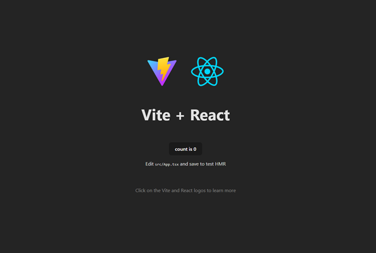

# :beginner: Create React App with Vite TypeScript

We’ll use **`Vite`** — the **next-generation build tool** that’s faster, more modern, and the **recommended way** to start React projects in 2025.

> **Why Vite instead of `create-react-app`?**
> - **Blazing fast dev server** (starts in <1 second)
> - **Native ES modules** (no bundling during development)
> - **Better TypeScript support out of the box**
> - **Smaller bundle size** and **faster production builds**
> - **Actively maintained** — `create-react-app` is **deprecated**

---

## :runner: Part 1: Scaffold A New React App
1. Run the following command:
```bash
npm create vite@latest react-vite-app-01 -- --template react-ts
```
- After running the command you’ll see similar prompts as shown below. Choose **No** to both:
><code>
>
>|
>o  Use rolldown-vite (Experimental)?:
>|  No :arrow_left:
>|
>o  Install with npm and start now?
>|  No :arrow_left:
>o  Scaffolding project in .../react-vite-app-01...
>|
>— Done. Now run:
>
> cd react-vite-app-01
>  npm install
>  npm run dev
>
></code>

### :information_source: What did the command do?
- `npm create vite@latest`: Runs the official Vite project scaffolder
- `react-vite-app-01`: Creates a folder called **react-vite-app-01** in the current folder.
- `--template react-ts`: Chooses **React with TypeScript**

>:bulb: This command creates a clean, new, modern project structure.


---

## :open_file_folder: Part 2: Navigate & Open the app in VS Code

2. Run the following command to navigate to the app's folder, download all dependencies and open the project in Visual Studio Code.
```bash
cd react-vite-app-01
npm install
```
><code>
>
>added 193 packages, and audited 194 packages in 12s
>
>47 packages are looking for funding
>  run `npm fund` for details
>
>found 0 vulnerabilities
>
></code>

> :information_source: **Why `npm install`?**  
> This downloads all dependencies listed in `package.json` into `node_modules/`. Required **once** after creating the project.

3. If you are using **Visual Studio Code** on Windows, run the following command after `npm install` has completed while you are still in the project's root folder. This will open the project in Visual Studio Code:
```bash
code .
```
4. Once your project is loaded in VS Code. Open a **terminal** in VS Code and run the following command. For Windows users use **command prompt** instead of powershell for you terminal:
```bash
npm run dev
```

The command `npm run dev`:
- Starts a **local development server**
- Opens `http://localhost:5173` in your default browser
- Enables **HMR** — edit code and see changes live!

> :information_source: **Why `npm run dev` instead of `npm start`?**  
> Vite uses `dev` for development server. It’s faster and supports **Hot Module Replacement (HMR)** — changes appear **instantly** without full reloads.


5. If your browser does not load the page automatically. Open your preferred browser and go to:

```bash
http://localhost:5173
```

6. You should now see the **Vite + React welcome page** with a Vite and React spinning logo along with a counter button similar to the screenshot below.



---
## :checkered_flag: **Summary Checklist**

- [x] Created app with `npm create vite@latest --template react-ts`  
- [x] Ran `npm install` and `npm run dev`  
---

## **Resources**

- [Node.js Docs](https://nodejs.org/docs/latest/api/documentation.html)
- [Vite Docs](https://vitejs.dev)
- [React Docs](https://react.dev)

---

[Back](01-Setup_React_Environment.md) -- [Next](03-Understand_React_Folder_And_Files.md)