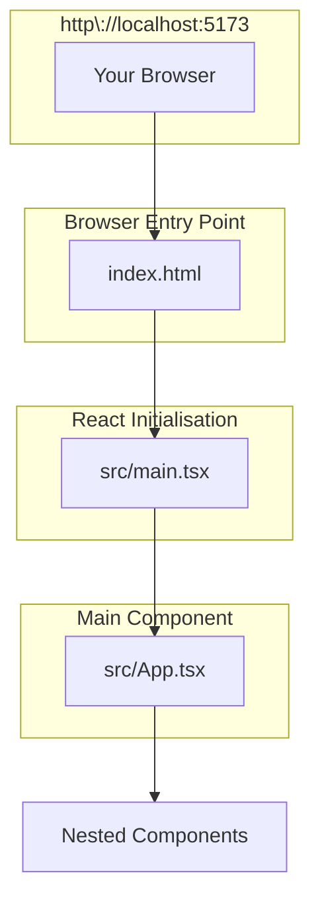

# :books: Explore the Project Structure

## :open_file_folder: Part 1: React Folder Structure
**1.** If you have not already done so, open your project in you preferred IDE and lets take a moment to explore and understand the React folder structure and main files.

- If you are using **Visual Studio Code** on Windows, run the following command after `npm install` has completed while you are still in the project's root folder. This will open the project in Visual Studio Code:
```bash
code .
```

**Here’s what each folder/file does:**

| Folder/File | Purpose |
|------------|---------|
| **`public/`** | Static assets (favicon, images) served as-is |
| `vite.svg` | Vite logo used in the app |
| **`src/`** | Where **all your code lives** |
| `assets/` | Images, icons, fonts |
| `App.tsx` | Main component (your app's root) |
| `main.tsx` | Entry point — renders `<App />` into DOM |
| `App.css` | Styles that are specific for the App component |
| `index.css` | Global styles that apply across your entire application |
| **`index.html`** | The single HTML page (in project root!) |
| **`vite.config.ts`** | Vite configuration (plugins, server, etc.) |
| **`package.json`** | Project metadata, dependencies, scripts |
| **`tsconfig.json`** | TypeScript configuration |
| **`tsconfig.node.json`** | TypeScript config for Vite |

> :bulb: **You’ll spend 90% of your time in the `src/` folder** 

---

## :scroll: Part 2: React Key Files Explained

#### 2. `index.html` (Project Root)

<details>
  <summary>Show me the file contents and explanation for index.html </summary>

  ```html
  <!DOCTYPE html>
  <html lang="en">
    <head>
      <meta charset="UTF-8" />
      <link rel="icon" type="image/svg+xml" href="/vite.svg" />
      <meta name="viewport" content="width=device-width, initial-scale=1.0" />
      <title>Vite + React</title>
    </head>
    <body>
      <div id="root"></div>
      <script type="module" src="/src/main.tsx"></script>
    </body>
  </html>
  ```

  **`index.html` Explanation:**
  - `<div id="root"></div>`: Where React mounts your app
  - `<script type="module" src="/src/main.tsx">`: Loads your React code using ES modules

</details>

#### 3. `src/main.tsx`

<details>
  <summary>Show me the file contents and explanation for src/main.tsx</summary>

  ```tsx
  import React from 'react'
  import ReactDOM from 'react-dom/client'
  import App from './App.tsx'
  import './index.css'

  ReactDOM.createRoot(document.getElementById('root')!).render(
    <React.StrictMode>
      <App />
    </React.StrictMode>,
  )
  ```

  **`src/main.tsx` Line-by-Line Explanation:**
  - `import App from './App.tsx'`: Imports your :arrow_forward: main component :arrow_backward:
  - `ReactDOM.createRoot(...)`: Creates a root to render React into
  - `document.getElementById('root')!`: Gets the `<div id="root">` from `index.html`
  - `<React.StrictMode>`: Enables extra warnings during development

</details>

#### 4. `src/App.tsx` (This is the :arrow_forward: **Main Component** :arrow_backward: with the default code created by Vite Template)

<details>
  <summary>Show me the file contents and explanation for src/App.tsx</summary>

  ```tsx
  import { useState } from 'react'
  import reactLogo from './assets/react.svg'
  import viteLogo from '/vite.svg'
  import './App.css'

  function App() {
    const [count, setCount] = useState(0)

    return (
      <>
        <div>
          <a href="https://vite.dev" target="_blank">
            
          </a>
          <a href="https://react.dev" target="_blank">
            
          </a>
        </div>
        <h1>Vite + React</h1>
        <div className="card">
          <button onClick={() => setCount((count) => count + 1)}>
            count is {count}
          </button>
          <p>
            Edit <code>src/App.tsx</code> and save to test HMR
          </p>
        </div>
        <p className="read-the-docs">
          Click on the Vite and React logos to learn more
        </p>
      </>
    )
  }

  export default App
  ```

  **`src/App.tsx` Line-by-Line Explanation:**
  - `import { useState } from 'react'`: Imports the `useState` hook
  - `import reactLogo from './assets/react.svg'`: Imports image as a variable
  - `import viteLogo from '/vite.svg'`: Imports from `public/` folder
  - `const [count, setCount] = useState(0)`: State for counter
  - `<>` and `</>`: Fragment shorthand (no extra DOM node)
  - `<a href="..." target="_blank">`: Link with image
  - `onClick={() => setCount(...)}`: Updates state on click
  - `className="..."`: CSS classes (not `class`)

</details>

---

### :thinking: How Does These Key Files Work Together?

The diagram below illustrates the relationship between the three core files in a default Vite + React setup.


#### 🔍 Explanation:

- **Your Browser**: Your browser goes to **http\://localhost:5173** to load the page.
- **index.html**: This is the entry point for your browser. It contains a `<div id="root"></div>` where your React app will be injected.
- **main.tsx**: This file bootstraps / initialises the React app. It uses `ReactDOM.createRoot` to render the `<App />` component into the `#root` div from `index.html`.
- **App.tsx**: This is the Main / Root component. It contains your app's layout, logic, and other nested components.
---
## :checkered_flag: **Summary Checklist**

- [x] Explored modern Vite project structure.
- [x] Understand the role and relationship of React's key files. 
---

## **Resources**

- [React Docs](https://react.dev)

---

[Back](./02-Scaffold_React_App.md) -- [Next](./04-React_JSX_and_Component.md)