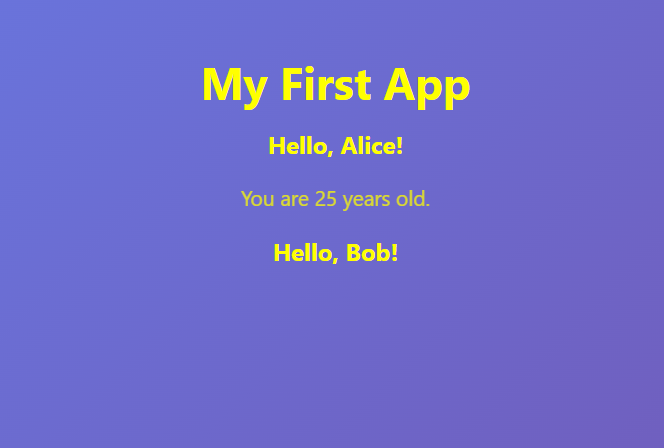

# :palm_tree: Understand JSX and Create a React Component

## :thinking: **Part 1: Understanding JSX (JavaScript XML)**

> :information_source: JSX lets you write **HTML inside JavaScript**. It’s not HTML — it’s a **syntax sugar**!

### 1. JSX (what you write)

```tsx
// JSX (what you write)
return <h1>Hello World</h1>;
```

#### Explanation:
`return <h1>Hello World</h1>;`
> This is a simple JSX return statement. It creates a `<h1>` heading element with the text *"Hello World"*. 
The whole thing gets converted to JavaScript by React's build tools.

### 2. JavaScript (what the browser runs)
```js
// Transpiled to (what the browser runs)
return React.createElement('h1', null, 'Hello World');
```

#### Explanation:
>
>`return React.createElement('h1', null, 'Hello World');`:
>This is the pure JavaScript equivalent of JSX.
>
>`React.createElement` is a function that takes three arguments: 
> - the tag name ('h1'), 
> - props (null here, meaning no attributes), and
> - children ('Hello World' text).
>
>:bulb: This is what JSX compiles to under the hood.
>

### :key: Key JSX Rules

| Rule | Example |
|------|--------|
| Always return one root element | `<div>...</div>` or `<></>` |
| Close all tags | `, <br />` |
| Use `className` not `class` | `className="btn"` |
| Embed JS with `{}` | `<p>Count: {count}</p>` |
| Comments in JSX | `{/* This is a comment */}` |

---

## :pencil: **Part 2: Modify The Main Component**

### 3. Let’s simplify `src/App.tsx` to understand the basics.
- Replace the contents of `src/App.tsx` with:

```tsx
import './App.css';         // Imports the CSS file to style the component.

function App() {  
  const name: string = "React Learner"; // Declares a constant variable name and sets it to a string value.

  return (  // Begins the JSX return statement.
    <div className="App"> {/* Creates a container div with class "App" for styling. */}
      <header className="App-header"> {/*Creates a header section with its own class.*/}
        <h1>Welcome to React + Vite!</h1>
        <p>Hello, {name}!</p> {/*{name} embeds the JavaScript variable name into the JSX*/}
        <button onClick={() => alert('Button clicked!')}> {/*Creates a button. onClick event handler that runs the arrow function */}
          Click Me  {/*The button's text.*/}
        </button>
      </header>
    </div>
  );
}

export default App; // Exports the component for use elsewhere.

```

<details>
<summary>Show me the Line-by-Line Explanation for src/App.tsx</summary>

>
>### Line-by-Line Explanation for  `src/App.tsx`:
>- `import './App.css';`: Imports the CSS file to style the component.
>- `function App() {`: Defines the App functional component.
>- `const name: string = "React Learner";`: Declares a constant variable `name` and sets it to a `string` value. This is plain JavaScript inside the function.
>- `return (`: Begins the JSX return statement.
>- `<div className="App">`: Creates a container div with class "App" for styling.
>- `<header className="App-header">`: Creates a header section with its own class.
>- `<h1>Welcome to React!</h1>`: Adds a level-1 heading with static text.
>- `<p>Hello, {name}!</p>`: Adds a paragraph. `{name}` embeds the JavaScript variable `name` into the JSX, so it dynamically inserts "React Learner".
>- `<button onClick={() => alert('Button clicked!')}>`: Creates a button. `onClick` is an event handler that runs the arrow function `() => alert('Button clicked!')` when clicked, showing a browser alert.
>- `Click Me`: The button's text.
>- `</button>`: Closes the button tag.
>- `</header>`: Closes the header.
>- `</div>`: Closes the div.
>- `);`: Ends the JSX.
>- `}`: Closes the function.
>- `export default App;`: Exports the component for use elsewhere.
>
</details>
<br>

- :bulb: Save the file and watch **HMR** update instantly!

---
## :page_facing_up: **Part 3: Create a New Component**

### 4. Create a new file: `src/components/Greeting.tsx`

```tsx
interface GreetingProps {
  name: string;
  age?: number; // Optional prop
}

const Greeting = ({ name, age }: GreetingProps) => {
  return (
    <div>
      <h2>Hello, {name}!</h2>
      {age && <p>You are {age} years old.</p>} {/* If age exists (truthy), it renders the paragraph with age; otherwise, nothing. && is a shorthand for "if true, then render this".*/}
    </div>
  );
};

export default Greeting;
```
<details>
<summary>Show me the Line-by-Line Explanation for Greeting.tsx</summary>

>
>### Line-by-Line Explanation for  `Greeting.tsx`:
>- `interface GreetingProps {`: Defines a TypeScript interface (like a blueprint) for the props this component expects.
>- `name: string;`: Specifies that `name` must be a string (required prop).
>- `age?: number; // Optional prop`: `age` is optional (`?`) and must be a number if provided.
>- `}`: Closes the interface.
>- `const Greeting = ({ name, age }: GreetingProps) => {` // Declares the Greeting component as a constant arrow function
>- `return (`: Starts the JSX return.
>- `<div>`: A container div.
>- `<h2>Hello, {name}!</h2>`: Heading that inserts the `name` prop dynamically.
>- `{age && <p>You are {age} years old.</p>}`: This is a conditional expression in JSX. If `age` exists (truthy), it renders the paragraph with `age`; otherwise, nothing. `&&` is a shorthand for "if true, then render this".
>- `</div>`: Closes the div.
>- `);`: Ends JSX.
>- `};`: Closes the arrow function.
>- `export default Greeting;`: Exports the component.
>
</details>

<br>

- Save the file and notice that the **HMR** has not updated! This is because we have created the component called Greeting.tsx but we have not ***"used"*** it yet!

---

## :zap: **Part 4: Use the Greeting Component**

### 5. Use `Greeting.tsx` in `App.tsx`. 
Modify `App.tsx` as follows:
* Import `Greeting.tsx`
* Remove `const name: string = "React Learner";` since we are not using it anymore.
* Change the heading to **My First App**
* Remove the `<p>` and `<button>` elements in the JSX
* Use `Greeting` with supplied parameters. (You can add your own extra `Greeting` if you want but be sure to supply at least a name prop.)

```tsx
import './App.css'; 
import Greeting from './components/Greeting';

function App() {
  return (
    <div className="App">
      <header className="App-header">
        <h1>My First App</h1>
        <Greeting name="Alice" age={25} />
        <Greeting name="Bob" />
      </header>
    </div>
  );
}

export default App; // Exports the component for use elsewhere.
```

<details>
<summary>Show me the Line-by-Line Explanation for App.tsx</summary>

- `import Greeting from './components/Greeting';`: Imports the Greeting component from its file.
- `function App() {`: Defines the App component.
- `return (`: Starts JSX.
- `<div className="App">`: Container div.
- `<header className="App-header">`: Header section.
- `<h1>My First App</h1>`: Static heading.
- `<Greeting name="Alice" age={25} />`: Renders the Greeting component, passing "Alice" as `name` and 25 as `age` (props are like attributes).
- `<Greeting name="Bob" />`: Renders another Greeting, only passing "Bob" as `name` (age is optional, so omitted).
- `</header>`: Closes header.
- `</div>`: Closes div.
- `);`: Ends JSX.
- `}`: Closes function.

</details>

---

## :dancer: **Part 5 (Optional): Styling Your App**

### 6. Add custom CSS
- Replace the content of `src/App.css` with:

```css
#root {
  max-width: 100vw;
  min-height: 100vh;
  margin: 0 auto;
  padding: 2rem;
  text-align: center;
}

body {
  background: linear-gradient(135deg, #667eea 0%, #764ba2 100%);
}

.App-header {
color: yellow;
}

h1 {
  font-size: 2.8rem;
  margin-bottom: 16px;
}

p {
  font-size: 1.3rem;
  margin: 12px 0;
  opacity: 0.75;
}
```

<details>
<summary>Show me the Line-by-Line Explanation for src/App.css</summary>

#### Line-by-Line CSS Explanation for `src/App.css`:
>
>`#root {` : **Targets** the HTML element with **id="root"**. The hash (#) means it's an ID selector.
>
>`max-width: 100vw;` : Sets the maximum width of the element to 100% of the viewport height. vh stands for "viewport width".
>
>`min-height: 100vh;` : Makes the container **at least as tall as the screen** (`vh` = viewport height). Your app fills the full screen.
>
>`margin: 0 auto;` : Adds 0 margin to the top and bottom, and automatically **centers** the element **horizontally**.
>
>`padding: 2rem;` : Adds space inside the element. 2rem means 2 times the root font size (usually 32px if root is 16px).
>
>`text-align: center;` : Centers the text **horizontally inside** the element.
>
> <br/>
>
>`body {` : **Targets** the **`<body>`** element of the HTML page.
>
>` background: linear-gradient(135deg, #667eea 0%, #764ba2 100%);` : Sets a gradient background that starts at a 135-degree angle. It blends from blue (#667eea) to purple (#764ba2).
>
> <br/>
>
>`.App-header {` : **Targets** elements with **class="App-header"**. The dot (.) means it's a class selector.
>
>`color: yellow;` : Sets the text color to yellow.
>
> <br/>
>
>`h1 {` : Targets all **`<h1>`** heading elements.
>
>`font-size: 2.8rem;` : Sets the font size to 2.8 times the root font size (e.g., 44.8px if root is 16px).
>
>`margin-bottom: 16px;` : Adds 16 pixels of space below the heading.
>
> <br/>
>
>`p {` : Targets all **`<p>`** paragraph elements.
>
>`font-size: 1.3rem;` : : Sets the font size to 1.3 times the root font size (e.g., 20.8px if root is 16px).
>
>`margin: 12px 0;` : Adds 12 pixels of space above and below the paragraph.
>
>`opacity: 0.75;` : Makes the paragraph slightly transparent. 1 is fully visible, 0 is invisible.
>
><br/>
>

</details>

---

#### :smiley: Review and Debug any Warnings or Errors.
After resolving any errors or bugs, you should have a simple yet **modern, fast React + TypeScript + Vite** page that looks like the image below:



> :bulb: Try creating some simple apps of your choice for your own project in order to familiarise yourself further with coding in React.


---
## :checkered_flag: **Summary Checklist**

- [x] Learned about JSX.
- [x] Wrote a new component with JSX & TypeScript.
- [x] Used new component.

---

## **Resources**

- [React Docs](https://react.dev)
- [TypeScript](https://www.typescriptlang.org)

---

[Back](./03-Understand_React_Folder_And_Files.md) -- [Next](./05-Guess_The_Number_Game.md)
