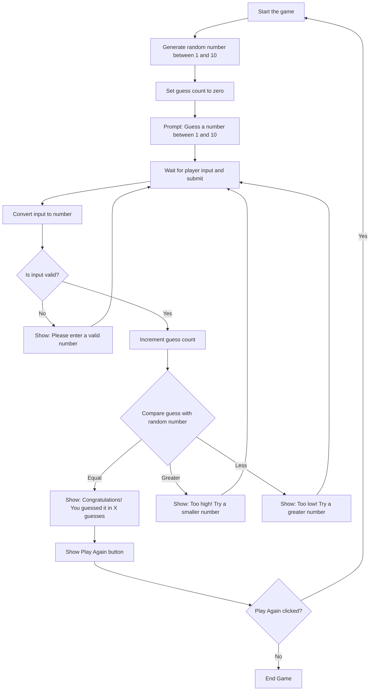

# :star: Task A: Create a "Guess the Number" Game

## :mortar_board: Task Description

Design an interactive game where the player tries to guess a randomly chosen number between 1 and 10. The game follows these steps:

- When the page loads, the game starts by generating a random number between 1 and 10.
- The player is prompted to guess the number.
- Each guess is checked:
  - If it's invalid (not a number or out of range), the player is asked to try again.
  - If it's too low or too high, the player receives a hint.
  - If it's correct, the game congratulates the player and shows how many guesses it took.
- After winning, the player can restart the game by clicking a "Play Again" button.

## :bulb: Suggested Steps to Build Your Game

1. **Use React to build the game.**  
   Focus on key concepts like input validation, conditionals (if/else), loops, and handling user interactions.

2. **Start by writing your algorithm in plain English.**  
   This means listing out each step the game should follow, like a recipe.

3. **(Optional) Create a flowchart.**  
   This helps you visualize how decisions are made in the game and ensures every possible choice leads to a clear outcome.

4. **Write and test your code.**  
   Use your algorithm and flowchart to guide your coding. Test your game with different inputs to make sure it works correctly and handles errors gracefully.

---

:information_source: The **algorithm**, **flowchart** and **sample code** are provided below. But before you peek at it, try to create you own.

<details>
<summary>Show me what you got!</summary>


<details>
<summary>Show me the Algorithm</summary>

## :feet: Step‑by‑Step Algorithm for "Guess the Number" Game.
1. Page loads and the game starts.
2. Generate a random number between 1 and 10 and store it.
3. Set the number of guesses to 0.
4. Show the message: *“Guess a number between 1 and 10.”*
5. Wait for the player to enter a guess and press **Submit**.
6. Convert the guess into a number.
7. If the guess is not a number or not between 1 and 10:
   - Show the message: *“Please enter a valid number between 1 and 10.”*
   - Go back to step 5.
8. Increase the guess counter by 1.
9. Compare the guess with the random number:
   - If the guess is **less** than the random number:
     - Show the message: *“Too low! Try a greater number.”*
     - Go back to step 5.
   - If the guess is **greater** than the random number:
     - Show the message: *“Too high! Try a smaller number.”*
     - Go back to step 5.
   - If the guess is **equal** to the random number:
     - Show the message: *“Congratulations! You guessed it in X guesses.”*
     - End the game and show a **Play Again** button.
10. If the player clicks **Play Again**:
    - Reload the game and start again from step 1.
</details>

<details>
<summary>Show me the Flowchart</summary>

## :eyes: Flowchart for "Guess the Number" Game.

</details>


<details>
<summary>Show me the Sample Code</summary>

**1.** **Replace** `src/App.tsx`:

```tsx
// Import React and the useState hook from the React library
import React, { useState } from 'react';
// Import the CSS file for styling
import './App.css';

// Define the main App component
function App() {
  // Create a random number between 1 and 10, store it in state (but it never changes)
  const [randomNumber] = useState(Math.floor(Math.random() * 10) + 1);
  // Store the user's current guess (starts as an empty string)
  const [guess, setGuess] = useState('');
  // Keep track of how many guesses the user has made
  const [guessCount, setGuessCount] = useState(0);
  // Store the message shown to the user (starts with instructions)
  const [message, setMessage] = useState('Guess a number between 1 and 10');
  // Keep track of whether the game is over or not
  const [gameOver, setGameOver] = useState(false);

  // Function that runs when the user submits their guess
  const handleSubmit = (e: React.FormEvent) => {
    e.preventDefault(); // Prevents the page from refreshing when the form is submitted
    const userGuess = parseInt(guess, 10); // Convert the guess (string) into a number

    // Check if the guess is not a number or outside the range 1–10
    if (isNaN(userGuess) || userGuess < 1 || userGuess > 10) {
      setMessage('Please enter a valid number between 1 and 10'); // Show error message
      return; // Stop running the rest of the function
    }

    // Increase the guess count by 1
    setGuessCount(guessCount + 1);

    // Check if the guess is correct
    if (userGuess === randomNumber) {
      // If correct, show a success message with number of guesses
      setMessage(`Congratulations! You guessed it in ${guessCount + 1} guesses.`);
      setGameOver(true); // End the game
    } else if (userGuess > randomNumber) {
      // If guess is too high
      setMessage('Too high! Try a smaller number.');
    } else {
      // If guess is too low
      setMessage('Too low! Try a greater number.');
    }

    // Clear the input field after each guess
    setGuess('');
  };

  // Function to restart the game by reloading the page
  const restartGame = () => {
    window.location.reload();
  };

  // JSX (the UI part of React) that defines what the user sees
  return (
    <div className="App"> {/* Main container with CSS class */}
      <header className="App-header"> {/* Header section */}
        <h1>Guess The Number</h1> {/* Game title */}
        <p>{message}</p> {/* Display the current message */}

        {/* If the game is not over, show the input form */}
        {!gameOver ? (
          <form onSubmit={handleSubmit}> {/* Form that runs handleSubmit when submitted */}
            <input
              type="text" // Input field for the guess
              value={guess} // Controlled input: value comes from state
              onChange={(e) => setGuess(e.target.value)} // Update guess state when typing
              placeholder="Enter 1–10" // Placeholder text inside the input
              className="guess-input" // CSS class for styling
            />
            <button type="submit" className="guess-btn">
              Submit Guess {/* Button to submit the guess */}
            </button>
          </form>
        ) : (
          // If the game is over, show the "Play Again" button
          <button onClick={restartGame} className="restart-btn">
            Play Again
          </button>
        )}
      </header>
    </div>
  );
}

// Export the App component so it can be used in other files
export default App;

```

### :key: Key Points for `src/App.tsx`
- The **state variables** (`randomNumber`, `guess`, `guessCount`, `message`, `gameOver`) are like memory slots that keep track of the game’s progress and control the game’s logic and UI.
- The **handleSubmit function** checks the guess, updates the message, and decides if the game continues or ends.
- The **restartGame function** simply reloads the page to start fresh.
- **Form submission** is intercepted with `preventDefault()` so the page doesn’t reload.
- **Conditional rendering** (`!gameOver ? ... : ...`) switches between the guess form and the restart button.
- The **UI** changes depending on whether the game is over or not.

---

**2.** **Add** to end of `src/App.css`:
```css
.guess-input {                /* Styles for the input box where the user types a guess */
  padding: 12px;              /* Adds space inside the input box so text isn’t cramped */
  font-size: 18px;            /* Makes the text inside the input larger */
  margin: 15px 0;             /* Adds vertical space (15px) above and below the input */
  border-radius: 8px;         /* Rounds the corners of the input box */
  border: 2px solid #ccc;     /* Adds a light gray border around the input */
  width: 200px;               /* Sets the input box width to 200 pixels */
  text-align: center;         /* Centers the text inside the input box */
}

.guess-btn, .restart-btn {    /* Styles for both the "Guess" and "Restart" buttons */
  padding: 12px 24px;         /* Adds space inside the button: 12px top/bottom, 24px left/right */
  font-size: 16px;            /* Sets the button text size */
  background: #4caf50;        /* Gives the button a green background */
  color: white;               /* Makes the button text white */
  border: none;               /* Removes the default border */
  border-radius: 8px;         /* Rounds the corners of the button */
  cursor: pointer;            /* Changes the mouse cursor to a pointer (hand) on hover */
  margin-top: 10px;           /* Adds space above the button */
}

.guess-btn:hover, .restart-btn:hover {  /* Styles when the user hovers over the buttons */
  background: #45a049;                  /* Changes the background to a slightly darker green */
}

.guess-btn:active, .restart-btn:active { /* Styles when the button is being clicked */
  transform: translateY(0) scale(0.98);  /* Slightly shrinks the button to give a "pressed" effect */
}
```
<!--

---

### :information_source: (OPTIONAL) Center The Content:
<details>

To **center your content horizontally but NOT vertically**, you need to modify the `body` styles in **`index.css`**.

Right now, this line is causing **both horizontal and vertical centering**:

```css
body {
  ...
  display: flex;
  place-items: center; /* This centers both horizontally and vertically */
  ...
}
```

The `place-items: center` is a shorthand for:
- `align-items: center` → **vertical centering**
- `justify-content: center` → **horizontal centering**

---

### Solution: Replace `place-items: center` with `justify-content: center`

#### Modify `index.css` → `body` rule:

```css
body {
  margin: 0;
  display: flex;
  justify-content: center; /* Only horizontal centering */
  min-width: 320px;
  min-height: 100vh;
}
```

> Remove `place-items: center` entirely and use `justify-content: center` instead.

---

### Why this works:

| Property              | Effect |
|-----------------------|--------|
| `display: flex`       | Enables flexbox |
| `justify-content: center` | Centers children **horizontally** |
| `align-items` (omitted) | Defaults to `stretch`, so content starts from the top → **no vertical centering** |
| `min-height: 100vh`   | Ensures full viewport height, so content appears at the top (vertically) |

---

### Optional: Vertically align to top (extra clarity)

If you want to be **explicit** that content should start from the top:

```css
body {
  margin: 0;
  display: flex;
  justify-content: center;
  align-items: flex-start; /* Explicitly top-align */
  min-width: 320px;
  min-height: 100vh;
}
```

But `align-items: flex-start` is optional — omitting `align-items` achieves the same effect (default is `stretch`, but with flex container, children align to top).

---

### Final Recommended `body` in `index.css`:

```css
body {
  margin: 0;
  display: flex;
  justify-content: center;
  min-width: 320px;
  min-height: 100vh;
}
```

---

### Result:
- Your game will be **horizontally centered**
- It will appear **at the top** of the page (not vertically centered)
- No changes needed in `App.tsx` or `App.css`

</details>

-->

</details>
</details>

---

### :video_game: **Creative Challenge: Upgrade Your Guess the Number Game!**  
You’ve nailed the basics—now it’s time to add your own twist. Choose one (or more) of these ideas, or invent something completely new. Keep it simple, fun, and achievable!  

:sparkles: **Beginner‑Friendly Feature Ideas**  
- :fireworks: **Celebration Effects**: Show confetti, fireworks, or a fun animation when the player guesses correctly.  
- :trophy: **First‑Try Trophy**: Display a trophy or medal if the player gets the number on their very first attempt.  
- :loud_sound: **Sound Effects**: Play a “ding” for correct guesses and a “buzz” for wrong ones.  
- :art: **Theme Switcher**: Add a button that lets players switch between light mode and dark mode.  
- :stopwatch: **Guess Timer**: Show how many seconds it takes the player to find the right number.  
- :bar_chart: **Scoreboard**: Keep track of how many attempts it took and display a “best score.”  
- :performing_arts: **Fun Messages**: Show different encouraging messages like “So close!” or “Try higher!” instead of plain text.  
- :game_die: **Range Selector**: Let the player choose the number range (e.g., 1–50 or 1–100) before starting the game.  


:bulb: **Tip**: Start small, pick one idea you like best and try adding it. Test it out and share your version with the class once it works. You can always come back and add more. The goal is to practice creativity and have fun experimenting with coding!  

---

## :checkered_flag: **Summary Checklist**

- [x] Created app with `npm create vite@latest --template react-ts`  
- [x] Ran `npm install` and `npm run dev`  
- [x] Wrote components with JSX & TypeScript  
- [x] Used `useState` for interactivity  
- [x] Built a number guessing game

---

## **Resources**

- [Vite Docs](https://vitejs.dev)
- [React Docs](https://react.dev)
- [TypeScript](https://www.typescriptlang.org)

---

[Back](./04-React_JSX_and_Component.md) -- [Next](../02-React_Layout_and_Routing/01-What_Is_A_Layout.md)