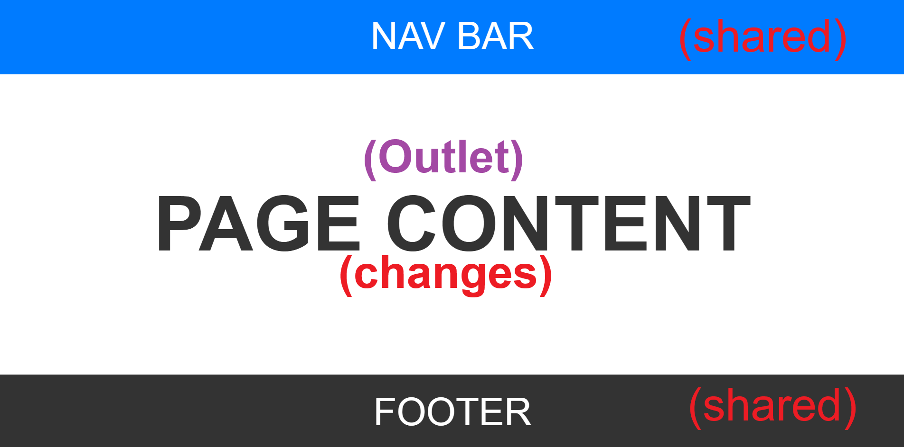
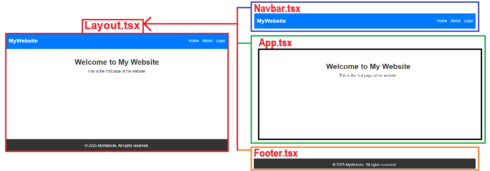
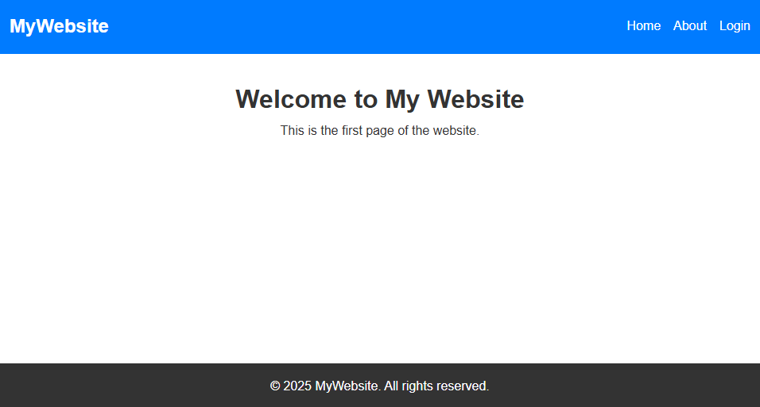

`
# :books: Part 1 – Understanding Shared Layouts in React

### :dart: Learning Goals

* What a **shared layout** is in React
* Why layouts are useful in multi-page applications
* How to build a reusable layout using **Navbar**, **Footer**, and **Layout** components
* How to place changing **page content inside the layout**

---

## :thinking: What is a “Layout” in React?

A **layout** is a shared structure that stays the same across multiple pages of a React app.

Most websites have UI elements that **don’t change**, such as:

:white_check_mark: A top navigation bar
:white_check_mark: A footer


Instead of rewriting these in every page, we create a **Layout component** and wrap all pages inside it.

---

## :framed_picture: Visual Layout Diagram



```
--------------------------------
|     Navbar (shared)          |
--------------------------------
|    Page Content (changes)    |
--------------------------------
|     Footer (shared)          |
--------------------------------
```

The Navbar and Footer stay on screen — only the **content in the middle** changes.

---

## :toolbox: Preliminary Steps

You will need to scaffold a new React App.

:information_source: If you are unsure of how to do that, please refer to [this document](../01-React_Setup_and_Component/02-Scaffold_React_App.md) and perform Step. 1 through to Step 6. Then return to continue with **"1. 🔨 Creating the Layout Components"**

---
## :framed_picture: Visual Representation of the compnent files.

As we build the components and assemble them, it might help to have an idea of what the finished layout would look like and where each component resides in the layout. The screenshot below is the finished product with the component file names in red.



<!-- Add Instruction to upload to Github here -->
---


## 1. :hammer: Creating the Layout Components

We will create **three shared components**, stored inside `src/components/`:

```
src/
├── components/
│   ├── Navbar.tsx
│   ├── Footer.tsx
│   └── Layout.tsx
├── App.tsx
└── main.tsx
```

Later, other pages (e.g. About, Contact, etc.) will plug into the layout.

---

## 2. :page_facing_up: `Navbar.tsx`

```tsx
export default function Navbar() {
  return (
    <nav className="navbar">
      <div className="container">
        <a href="#" className="logo">MyWebsite</a>
        <ul className="nav-links">
          <li>
            <a href="#home">Home</a>
          </li>
          <li>
            <a href="#about">About</a>
          </li>
          <li>
            <a href="#contact">Login</a>
          </li>
        </ul>
      </div>
    </nav>
  );
}
```

> :soon: When we add React Router in Part 2, the `<a>` tags will become `<NavLink>` components.

---

## 3. :page_facing_up: `Footer.tsx`

```tsx
export default function Footer() {
  return (
    <footer className="footer">
      <div className="container">
        <p>&copy; 2025 MyWebsite. All rights reserved.</p>
      </div>
    </footer>
  );
}
```

---

## 4. :page_facing_up: `Layout.tsx`

```tsx
import Navbar from "./Navbar";
import Footer from "./Footer";

type LayoutProps = {
  children: React.ReactNode;
};

export default function Layout({ children }: LayoutProps) {
  return (
    <>
      <Navbar />

      <main className="content">
        {children}
      </main>

      <Footer />
    </>
  );
}
```

### :brain: Line-by-Line Explanation

* `children` = whatever page content is passed inside `<Layout>...</Layout>`.
* `<Navbar />` and `<Footer />` always stay on screen.
* `<main>` is styled to grow and fill available space using flexbox.

---

## 5. :page_facing_up: `App.tsx`

```tsx
import './App.css'
import Layout from "./components/Layout";

export default function App() {
  return (
    <Layout>
      <section id="home">
        <h1>Welcome to My Website</h1>
        <p>This is the first page of the website.</p>
      </section>
    </Layout>
  );
}
```


---

# :art: CSS Setup

## 6. :page_facing_up: `main.tsx`

- Open `main.tsx` and delete or comment out `import './index.css'`. 

Below is an example of main.tsx with the `import './index.css'` line commented out. 
This is to prevent the CSS rules from index.css from overiding our custom CSS rules that we place in App.css.
```tsx

import { StrictMode } from 'react'
import { createRoot } from 'react-dom/client'
// import './index.css'         // <-- Comment out this line
import App from './App.tsx'

createRoot(document.getElementById('root')!).render(
  <StrictMode>
    <App />
  </StrictMode>,
)

```

## 7. :page_facing_up: `App.css`

- Copy the CSS below and replace the contents of `App.css` with it:

```css

/* General Reset */
* {
  margin: 0;
  padding: 0;
  box-sizing: border-box;
}

body {
  font-family: Arial, sans-serif;
  line-height: 1.6;
  color: #333;
}

/* Ensure full height layout */
html, body {
  height: 100%;
  display: flex;
  flex-direction: column;
}

/* Let main content grow to fill space */
.content {
  flex: 1;
  padding: 2rem 1rem;
  text-align: center;
}

/* Navigation Bar */
.navbar {
  background-color: #007BFF;
  color: white;
  padding: 1rem 0;
}

.navbar .container {
  display: flex;
  justify-content: space-between;
  align-items: center;
  max-width: 1200px;
  margin: 0 auto;
  padding: 0 1rem;
}

.navbar .logo {
  font-size: 1.5rem;
  font-weight: bold;
  text-decoration: none;
  color: white;
}

.navbar .nav-links {
  list-style: none;
  display: flex;
  gap: 1rem;
}

.navbar .nav-links li a {
  text-decoration: none;
  color: white;
  transition: color 0.3s;
}

.navbar .nav-links li a:hover {
  color: #FFD700;
}

/* Main Content */
.content {
  padding: 2rem 1rem;
  text-align: center;
}

/* Footer */
.footer {
  background-color: #333;
  color: white;
  text-align: center;
  padding: 1rem 0;
}

.footer .container {
  max-width: 1200px;
  margin: 0 auto;
  padding: 0 1rem;
}

/* Make React layout fill full height so footer stays at bottom */
html, body, #root {
  height: 100%;
  display: flex;
  flex-direction: column;
}

```

---
## :framed_picture: Visual Representation

You should now have a page that looks like the screenshot below. This may not look like much but you have just built a page with a shared layout. We will see the benefit of having a shared layout as we begin to create more pages.



<!-- Add Instruction to upload to Github here -->
---

## :rocket: What You Learned in Part 1

| Concept           | Meaning                                       |
| ----------------- | --------------------------------------------- |
| Shared layout     | A reusable wrapper used across multiple pages |
| `children` prop   | Lets components wrap other components         |
| Navbar & Footer   | Static UI elements used site-wide             |
| Global CSS import | One `styles.css` used across whole app        |
| Sidebar extension | Shows how layouts can grow over time          |

---

## :fast_forward: Next Step (Part 2)

We will add **React Router**, so pages like Home, About and Login become real routes:

:white_check_mark: Layout stays
:white_check_mark: Navbar becomes real navigation (`<NavLink>`)
:white_check_mark: Content updates **without re-loading the page**

---

[Back](../01-React_Setup_and_Component/05-Guess_The_Number_Game.md) -- [Next](02-Introducing_React_Router.md)