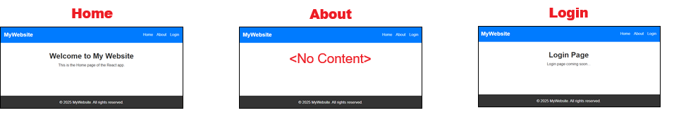

# :vertical_traffic_light: Part 2 – Multi-Page Navigation with React Router

### :dart: Learning Goals

* Understand how React Router is used to navigate between pages **without reloading the browser**
* Create multiple **pages** inside a React app (`Home`, `About`, `Login`)
* Add routing using `<BrowserRouter>`, `<Routes>`, and `<Route>`
* Update the Navbar to use `<NavLink>` instead of `<a>` links
* See how the **shared Layout stays visible across all pages**
* Create your own new page (About) using the learning pattern

---

## :thinking: Why Do We Need React Router?

React apps are **Single Page Applications (SPAs)**.

That means:
- The browser only loads **one HTML page**, ever.
- When users click a link, React **swaps components in and out**, but the page is not reloaded.
- This makes apps faster and feel more like desktop software.

:white_check_mark: **React Router** gives us navigation **without reloading the page** <br/>
:x: HTML `<a href="">` forces a **full page refresh** and breaks the SPA model

In the previous exercise, we used `<a>` tags for our navigation links such as **Home**, **About** and **Login** in **`Navbar.tsx`**. 

In this exercise we will **replace `<a>` with `<NavLink>`** in **Navbar.tsx** and use React Router for navigation instead.

---

## :hammer_and_wrench: 1 – Install React Router

Open a **new terminal** in VS-Code: (Click on the plus button as shown in the screenshot below)


In your project folder, run:

```bash
npm install react-router-dom
```
<!-- Add short one paragraph explanation of the npm install react-router-dom command -->

When it has completed installing, you can close the terminal with:

```bash
exit
```

---

## :file_folder: 2 – Updated Folder Structure

We are now adding a **pages** folder inside `src/`. (In VS-Code, `Right-Click` src and choose `New Folder...`)

```
src/
├── components/
│   ├── Navbar.tsx
│   ├── Footer.tsx
│   └── Layout.tsx
├── pages/
│   ├── Home.tsx
│   ├── Login.tsx
│   └── (About.tsx)   ← You will create this later
├── App.tsx
├── main.tsx
└── App.css
```

---

## :page_facing_up: 3 – Create `Home.tsx`

This will now be our home page file instead of using the default `app.tsx` file. 

:memo: `src/pages/Home.tsx`

```tsx
export default function Home() {
  return (
    <section id="home">
      <h1>Welcome to My Website</h1>
      <p>This is the Home page of the React app.</p>
    </section>
  );
}
```

---

## :page_facing_up: 4 – Create `Login.tsx` (placeholder for now)

* This page is just a placeholder to allows the Login link to work. We will design a real working login page in future exercises.

:memo: `src/pages/Login.tsx`

```tsx
export default function Login() {
  return (
    <section>
      <h1>Login Page</h1>
      <p>Login page coming soon...</p>
    </section>
  );
}
```

---

## :page_facing_up: 5 – Update `Navbar.tsx` to use `<NavLink>`

```tsx
import { NavLink } from "react-router-dom";

export default function Navbar() {
  return (
    <nav className="navbar">
      <div className="container">
        <NavLink to="/" className="logo">MyWebsite</NavLink>
        <ul className="nav-links">
          <li>
            <NavLink to="/">Home</NavLink>
          </li>
          <li>
            <NavLink to="/about">About</NavLink>
          </li>
          <li>
            <NavLink to="/login">Login</NavLink>
          </li>
        </ul>
      </div>
    </nav>
  );
}
```

### :brain: Why We Changed It

| Before (Part 1)                    | Now (Part 2)                    |
| ---------------------------------- | ------------------------------- |
| `<a href="/about">`                | `<NavLink to="/about">`         |
| Reloads the whole page :grimacing:          | Swaps content without refresh :white_check_mark: |
| Browser thinks it's a **new page** | Still inside the same React app |
| Layout disappears                  | Layout stays on screen          |

---

## :page_facing_up: 6 – Update `App.tsx` to Add Routes

```tsx
import { BrowserRouter, Routes, Route } from "react-router-dom";
import './App.css'
import Layout from "./components/Layout";
import Home from "./pages/Home";
import Login from "./pages/Login";

export default function App() {
  return (
    <BrowserRouter>
      <Layout>
        <Routes>
          <Route path="/" element={<Home />} />
          <Route path="/login" element={<Login />} />
        </Routes>
      </Layout>
    </BrowserRouter>
  );
}
```

:white_check_mark: The Layout still wraps everything, so Navbar + Footer stay visible. <br/>
:white_check_mark: Only the middle content changes based on route.

---

## :framed_picture: Visual Representation

You should now have a page with the **Home**, **About** and **Login** link working. The **About** link does not load any **content** yet as there is no page file associated with it. However, the link will still work and show the *Navigation Bar* and *Footer* meaning that our layout is still working even without any content yet. A visual represenation of the pages are shown below:



Test all three links in the Navbar if you have not done so to ensure your code is working correctly
   :white_check_mark: Home loads <br/>
   :white_check_mark: About loads but without content <br/>
   :white_check_mark: Login loads placeholder page <br/>
   :books: Layout stays on screen for all pages
<!-- Add Instruction to upload to Github here -->

---

## :dart: 7 – Exercise: Create the About Page

### :weight_lifting: Your Task:
Using the information you have learned, create and About page that has:
* Heading that dipslay "About Page" 
* Paragraph that displays "This is the About page."

<details>
<summary>Show me how.</summary>

  ### How to Create the About Page and Add the New Route:

  1. **Create** a new file: `src/pages/About.tsx`
  2. **Add** this content:

  ```tsx
  export default function About() {
    return (
      <section>
        <h1>About Page</h1>
        <p>This is the About page.</p>
      </section>
    );
  }
  ```

  3. **Import** the new page in `App.tsx`:

  ```tsx
  import About from "./pages/About";
  ```
  4. **Add** the route in `App.tsx`:

  ```tsx
  <Route path="/about" element={<About />} />
  ```

  :bulb: You can use the completed `App.tsx` file below for reference as to where to import and add the statements:

  `App.tsx`

  ```tsx
  import { BrowserRouter, Routes, Route } from "react-router-dom";
  import './App.css'
  import Layout from "./components/Layout";
  import Home from "./pages/Home";
  import About from "./pages/About";
  import Login from "./pages/Login";

  export default function App() {
    return (
      <BrowserRouter>
        <Layout>
          <Routes>
            <Route path="/" element={<Home />} />
            <Route path="/about" element={<About />} />
            <Route path="/login" element={<Login />} />
          </Routes>
        </Layout>
      </BrowserRouter>
    );
  }
  ```
</details>

<br/>

### :cockroach: Test and debug
Once you completed the exercise, please make sure to re-test all three links in the Navbar again to ensure they are working as intended
   :white_check_mark: Home loads as before <br/>
   :white_check_mark: About loads with the new content <br/>
   :white_check_mark: Login loads placeholder page <br/>
   :books: Layout stays on screen for all pages

<!-- 5. Commit your changes with the message "Added About page and connected React Router navigation". -->

---

## :gift: Bonus: Add Active Link Styling (Optional)

:exclamation: By default, **`<NavLink>` adds a CSS class called `.active`** to the link that matches the current page. 

In `App.css` we already have a `color:white` rule for fonts (line 59) for `.navbar`, `.nav-links`, `li` and `a` (line 57). 

To ensure we override the `color:white` rule, we need to have better specifity. 

Add the rules below to the **bottom of App.css** and save it:

```css
/* Highlight current page in navbar */
.navbar .nav-links li a.active {
  font-weight: bold;
  color: yellow;
}
```
You should now see the link appear in **<span style="color:yellow; background:#007BFF">Yellow</span>** for the page you are currently on. 
Ensure there are no warnings or errors in the **PROBLEMS** tab of your terminal panel.
Re-test and debug any issues that come up. 

:white_check_mark: This gives users feedback about **which page they are currently on** <br/>
:white_check_mark: Helps accessibility and UI clarity <br/>
:white_check_mark: Works automatically — no JavaScript needed

### :question: Why don't we just delete the colour:white rule for fonts (line 59)? 
When you visit a link, browsers often change the link's colour (usually purple by default) to show you've been there.
If we had simply deleted the rule at line 59 (I suggest you try this to see the effect), it will cause the visted link effect to appear i.e. Home, About etc... to go purple after we clicked it for the first time.
This is helpful in articles or search results where you want to remember what you've already clicked.
But in **navigation bars**, we usually **don’t** use visited link styles. Here are some reasons why:

#### 1. **Navigation Should Look Consistent**
- A nav bar is like a map of your site. If some links are purple and others are blue, it can look messy or broken.
- Users might think something is wrong or that the site is outdated.

#### 2. **Visited Colors Can Be Confusing**
- Just because someone visited a page before doesn’t mean they don’t want to go there again.
- If the link looks different, users might think it’s disabled or no longer relevant.

#### 3. **Design and Branding**
- Navigation menus are a key part of a site’s design. Clients often want them to match their brand’s colours and style.
- Letting the browser change link colours can break that visual harmony.

#### 4. **Navigation Is Not Like Content Links**
- In blog posts or search results, visited links help you track what you’ve read.
- In nav bars, links are more like buttons and they’re meant to be clicked repeatedly, not just once.

---

## :twisted_rightwards_arrows: Alternative Router Pattern (Not Used Yet)

Since we have learned about React Routing I'd like to also mention that React Router also supports **nested routes**, like this:

```tsx
<BrowserRouter>
  <Routes>
    <Route element={<Layout />}>
      <Route path="/" element={<Home />} />
      <Route path="/about" element={<About />} />
      <Route path="/login" element={<Login />} />
    </Route>
  </Routes>
</BrowserRouter>
```

But this version requires an extra component called `<Outlet>` inside `Layout.tsx`:

```tsx
export default function Layout() {
  return (
    <>
      <Navbar />
      <Outlet />   {/* Where page content appears */}
      <Footer />
    </>
  );
}
```

### :bulb: Why We Are NOT Using It Yet

| Reason                                      | Beginner Impact             |
| ------------------------------------------- | --------------------------- |
| Adds new concepts (`Outlet`, nested routes) | More cognitive load         |
| Requires major Layout change                | Harder to connect to Part 1 |
| Not needed for simple two-page apps         | Better introduced later     |

:white_check_mark: We will switch to this pattern **when we add protected routes and nested dashboards** in a later module.

---

## :rocket: What You Learned in Part 2

| Concept                   | Meaning                                                   |
| ------------------------- | --------------------------------------------------------- |
| React Router              | Lets React apps have multiple pages without a full reload |
| `<BrowserRouter>`         | Enables routing in the app                                |
| `<Routes>` + `<Route>`    | Map URLs to components                                    |
| `<NavLink>`               | A link that supports “active page” styling                |
| Shared Layout still works | Navbar + Footer stay visible across pages                 |
| Exercise                  | You created your own page and route                       |

---

## :fast_forward: Next Step (Part 3)

In **Part 3**, we will:

:heavy_check_mark: Create a real **Login page UI** <br/>
:heavy_check_mark: Learn how to handle **form inputs** in React <br/>
:heavy_check_mark: Begin moving toward **state management** and **authentication flows**

---

[Back](./01-What_Is_A_Layout.md) -- [Next](./03-Create_A_Login_Form.md)