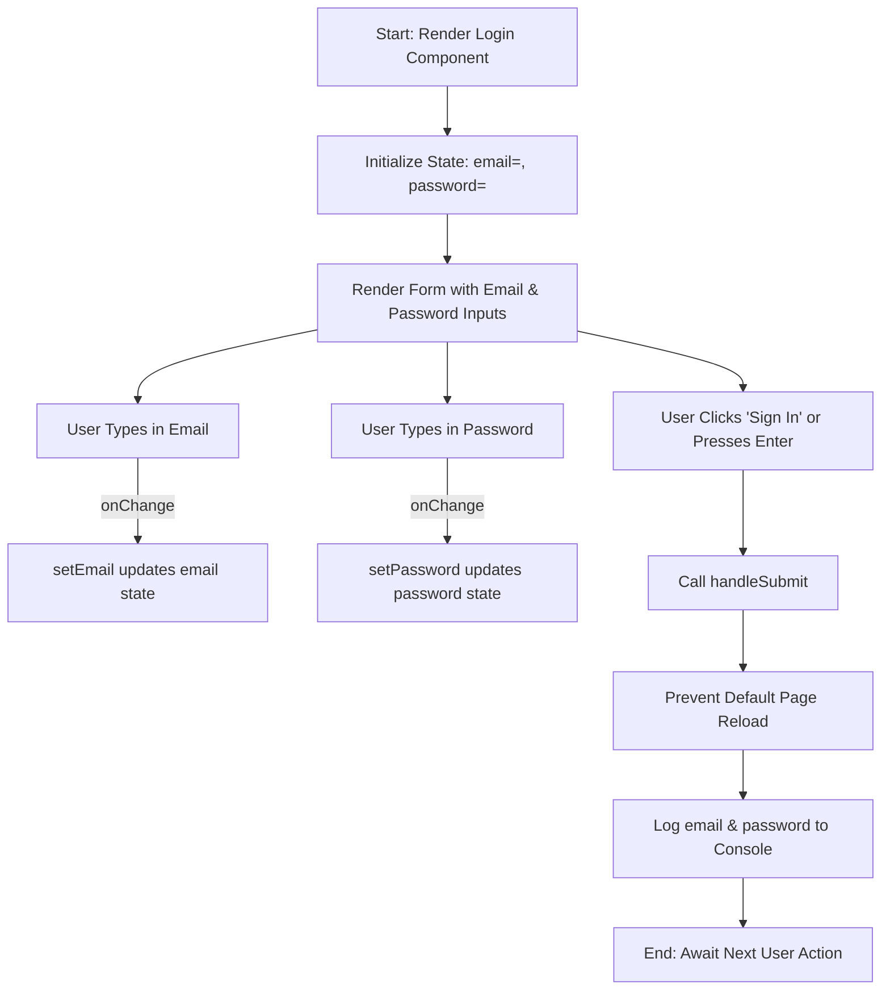
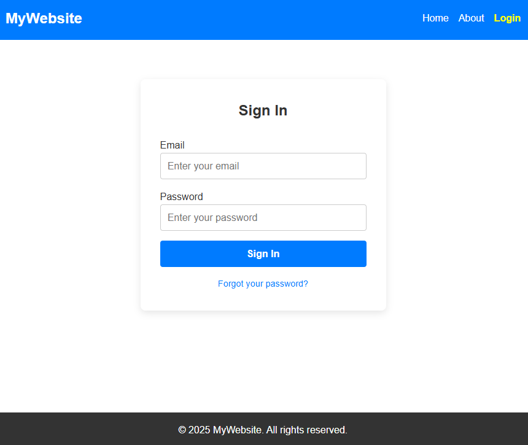

# :closed_lock_with_key: Part 3 – Building the Login Page UI

### :dart: Learning Goals

* Create a **real login form UI** in React
* Understand controlled form fields (`email`, `password`)
* Add new CSS styles for a centered login card
* See how React handles form input values
* Prepare the app for **real authentication in the next lesson** (Supabase)

> :warning: **No login logic yet** — the form will *not* submit or validate.
> That happens in **Part 4: React + Supabase Authentication**.

---
<!--


-->
---

## 1. :page_facing_up: Update `Login.tsx` (Replace Placeholder Page)

Review the code provided then open `src/pages/Login.tsx` and **replace everything** with the code below:

```tsx
// Import the useState hook from React.
// useState lets this component store and update values (email & password)
// every time the user types into the form.
import { useState } from "react";

export default function Login() {
  // Declare state variables for form fields.
  // "email" and "password" will always hold the latest text typed by the user.
  // setEmail and setPassword are functions used to update those values.
  const [email, setEmail] = useState("");
  const [password, setPassword] = useState("");

  // This function is triggered when the user presses the "Sign In" button
  // or submits the form by pressing Enter.
  function handleSubmit(e: React.FormEvent) {
    // Prevent the browser from refreshing the page (default form behaviour).
    // In React apps, we ALWAYS prevent full page reload.
    e.preventDefault();

    // For now we just log the data to the console.
    // In the next lesson, we will replace this with a real Supabase login request.
    console.log("Login form submitted:", { email, password });
  }

  return (
    // This section gives structure for layout/styling.
    // The CSS class "login-container" centres the login card on the page.
    <section className="login-container">
      <div className="login-card">
        <h2>Sign In</h2>

        {/* 
          The "onSubmit" attribute tells React what to do when the form is submitted.
          In this case, it calls our handleSubmit() function above.
        */}
        <form onSubmit={handleSubmit} className="login-form">
          
          {/* EMAIL FIELD */}
          <label>
            Email
            <input
              type="email"                 // built-in browser validation for email format
              value={email}                // controlled input (value stored in state)
              onChange={(e) => setEmail(e.target.value)} // updates state as user types
              placeholder="Enter your email"
              required                     // browser will not allow empty submission
            />
          </label>

          {/* PASSWORD FIELD */}
          <label>
            Password
            <input
              type="password"              // hides the text while typing
              value={password}
              onChange={(e) => setPassword(e.target.value)}
              placeholder="Enter your password"
              required
            />
          </label>

          {/* SUBMIT BUTTON */}
          <button type="submit" className="btn-primary">
            Sign In
          </button>
        </form>

        {/* This link does nothing yet, but will connect later to Supabase reset-password */}
        <a href="#" className="forgot-link">Forgot your password?</a>
      </div>
    </section>
  );
}
```

---

## :brain: Explanation of the code in `Login.tsx`

### :white_check_mark: Why do we use `useState`?

React apps **do not automatically remember** what a user types into a text field.
To store the text typed into `<input>` fields, we need **state variables**.

Example:

```tsx
const [email, setEmail] = useState("");
```

| Part           | Meaning                                       |
| -------------- | --------------------------------------------- |
| `email`        | Stores the current value typed into the field |
| `setEmail()`   | Updates the value when the user types         |
| `useState("")` | Sets the initial value to an empty string     |

So when the user types `hello@gmail.com`, React runs:

```tsx
setEmail("hello@gmail.com");
```

and updates the screen **without reloading the page**.

---

### :white_check_mark: Why do we use `onChange` inside `<input>`?

```tsx
onChange={(e) => setEmail(e.target.value)}
```

*Runs every time a letter is typed.*
`e.target.value` is just JavaScript for “whatever is inside the textbox right now”.

Without this, React would never remember the value.

---

### :white_check_mark: Why do we need `event.preventDefault()` in the form submit?

HTML forms try to **refresh the entire page** when submitted.

React apps are **Single Page Applications (SPAs)**, so we stop that:

```tsx
e.preventDefault();
```

This keeps us inside the React app and lets us run custom logic — like talking to Supabase.

---

## :brain: Key Concepts Introduced in `Login.tsx`

| Concept              | Meaning                                                    |
| -------------------- | ---------------------------------------------------------- |
| `useState`           | React hook used to store form values (`email`, `password`) |
| `onChange`           | Runs every time the user types, updating state             |
| `handleSubmit`       | Prevents page reload and will later call Supabase login    |
| `console.log()`      | Temporary debugging so we see form output                  |
| `required` attribute | Simple browser-level validation, no JS needed              |

---

<details>
    <summary>Show me the Logic Flowchart for Login.tsx</summary>

# :closed_lock_with_key: Login Component Logic

This section explains how the `Login` component works under the hood.  
We’ll use a flowchart to visualize the flow of the logical steps inside the component:

## :bar_chart: Flowchart: Component Logic


---

### :memo: Summary
- **State Management**: `useState` keeps track of `email` and `password`.  
- **Controlled Inputs**: Every keystroke updates state via `onChange`.  
- **Form Submission**: `handleSubmit` prevents a page reload and logs the credentials.  


</details>

---
## 2. :art: Add Login Form Styles to `App.css`

Scroll to the **bottom of `App.css`** and paste the styles below:

```css
/* ------------------------------ */
/* Login Form Styles              */
/* ------------------------------ */

.login-container {
  display: flex;
  justify-content: center;
  align-items: center;
  flex: 1;
  padding: 2rem 1rem;
}

.login-card {
  background: white;
  padding: 2rem;
  width: 100%;
  max-width: 400px;
  border-radius: 8px;
  box-shadow: 0 4px 12px rgba(0, 0, 0, 0.1);
  text-align: center;
}

.login-card h2 {
  margin-bottom: 1.5rem;
}

.login-form {
  display: flex;
  flex-direction: column;
  gap: 1rem;
  text-align: left;
}

.login-form input {
  width: 100%;
  padding: 0.7rem;
  border: 1px solid #ccc;
  border-radius: 4px;
  font-size: 1rem;
}

.btn-primary {
  background-color: #007BFF;
  color: white;
  padding: 0.8rem;
  border: none;
  border-radius: 4px;
  cursor: pointer;
  font-size: 1rem;
  font-weight: bold;
  transition: background 0.3s;
}

.btn-primary:hover {
  background-color: #0056b3;
}

.forgot-link {
  display: block;
  margin-top: 1rem;
  font-size: 0.9rem;
  color: #007BFF;
  text-decoration: none;
}

.forgot-link:hover {
  text-decoration: underline;
}
```

---

## 3. :page_facing_up: `App.tsx` (No Changes)

:white_check_mark: No changes needed since we already have the route working in the last exercise, except **Login** now shows **real UI**, not just the placeholder text.

---

## 4. :framed_picture: Visual Representation

You should now have a login page as shown below:



Right now the form only logs the result:

```tsx
console.log("Login form submitted:", { email, password });
```

In **Part 4 (Supabase Auth)** we will replace that line with:

```tsx
const { data, error } = await supabase.auth.signInWithPassword({
  email,
  password
});
```

Which will:

:white_check_mark: Check login credentials against Supabase
:white_check_mark: Return an authenticated user session
:white_check_mark: Redirect the user to a protected page

---

## 4. :white_check_mark: Test Checklist

| Step                 | Expected Result                         |
| -------------------- | --------------------------------------- |
| Click **Home**       | Still loads the home page               |
| Click **About**      | Still loads About page                  |
| Click **Login**      | Shows the new login form                |
| Type in form         | Console logs email + password on submit |
| Layout stays visible | Navbar & Footer still shared            |


:white_check_mark: All routing still works
:white_check_mark: New UI appears only on `/login`


---

## :rocket: What You Learned in Part 3

| Concept                 | Meaning                                           |
| ----------------------- | ------------------------------------------------- |
| Controlled Inputs       | Form fields that store their value in React state |
| Basic Form Submit       | Prevents page reload and prepares for real logic  |
| Component-level state   | Separate state for each page/component            |
| UI-first authentication | Build the interface before wiring up backend      |
| Reusable styles         | Login form styled without changing layout CSS     |

---

## :fast_forward: Next Step – Part 4

> **"React + Supabase Authentication"**

In **Part 4**, we will:

:white_check_mark: Create a Supabase project
:white_check_mark: Connect React app using environment variables
:white_check_mark: Replace `console.log` with real `supabase.auth.signInWithPassword()`
:white_check_mark: Handle success :white_check_mark: and error messages :x:
:white_check_mark: Redirect user to a protected page after login

---

[Back](02-Introducing_React_Router.md) -- [Next](../03-React_Supabase_Auth/04-Login_Using_Supabase_Auth.md)
