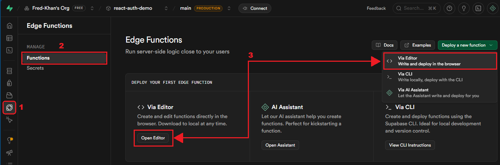
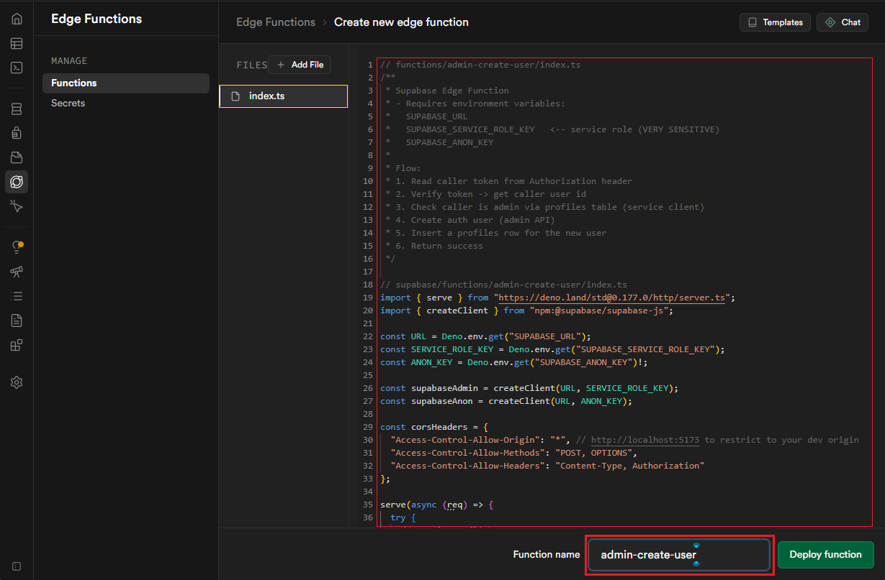
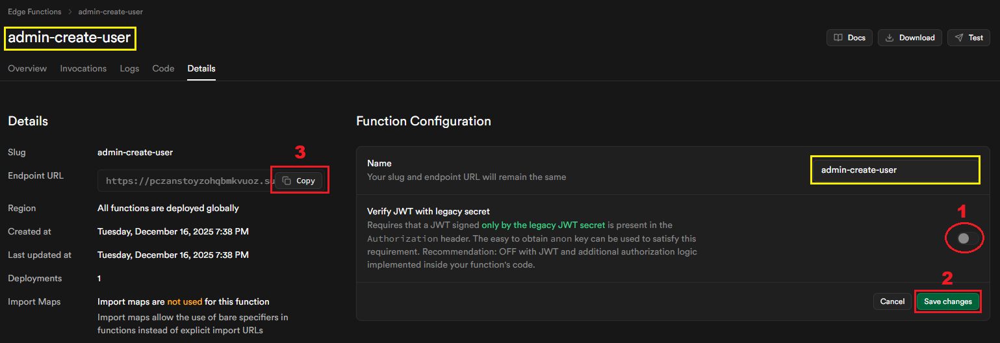
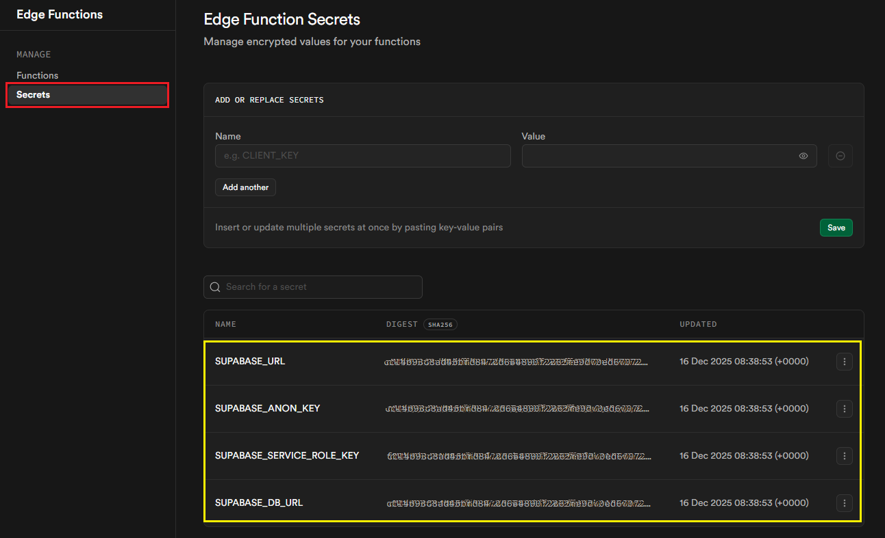
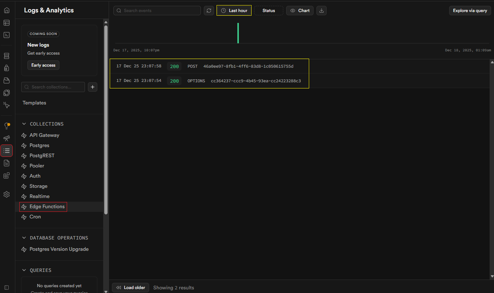
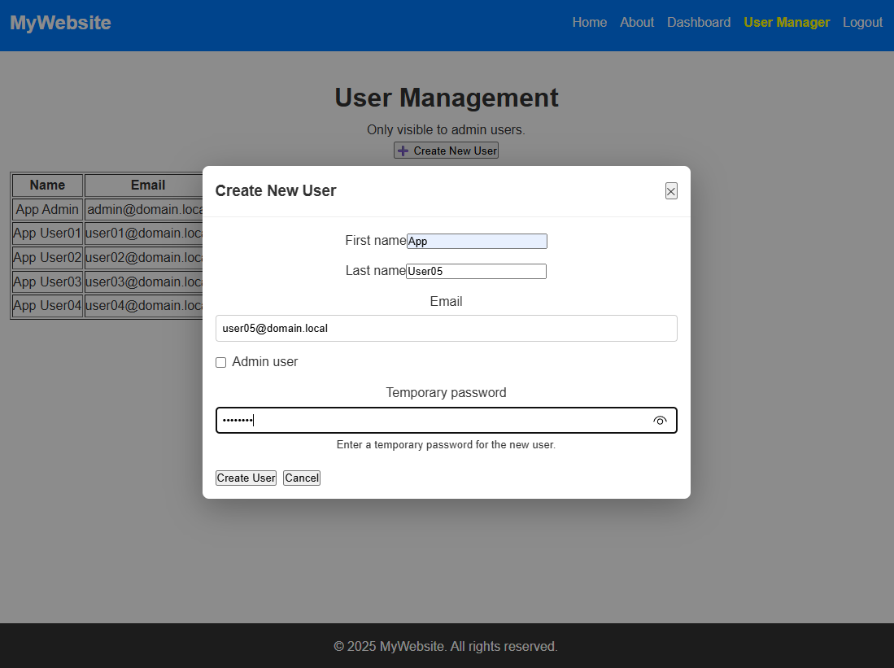
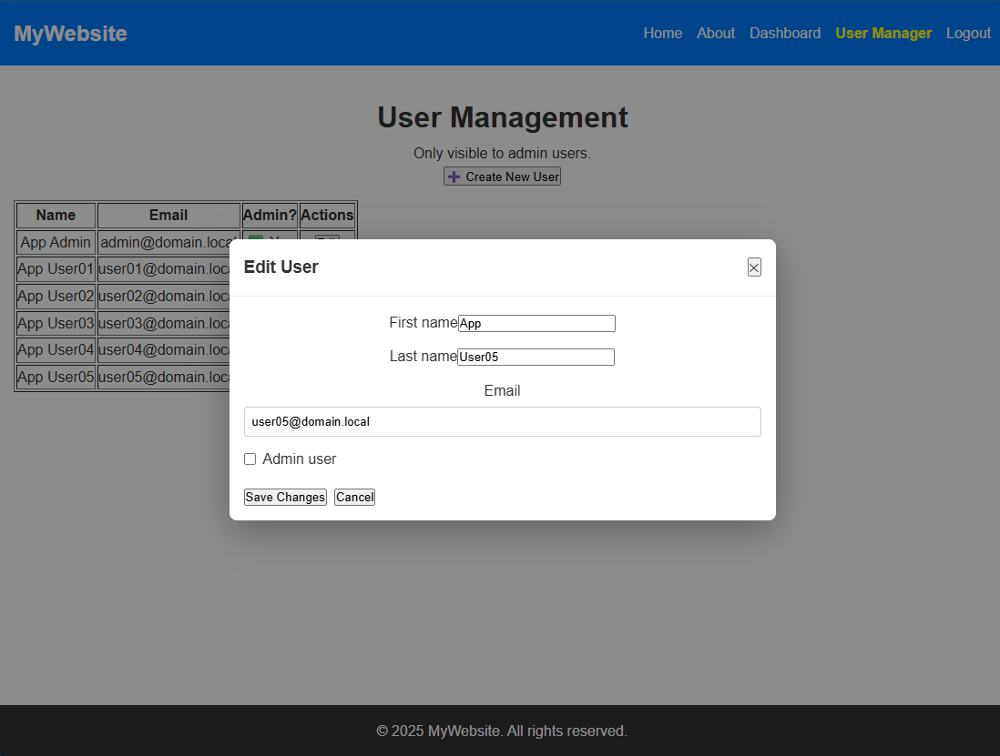

# :family_man_girl_boy: Part 7 — Admin Create / Edit Users (Modal)

This part builds an **admin modal UI** for creating real Supabase Auth users (admin supplies a temporary password) and editing data in the profiles table. 

It uses a **Supabase Edge Function** to run privileged admin operations (creating auth users) securely with the `service_role` key. 

No delete functionality included, we’ll add `is_deleted` later to denote deleted or disabled user accounts.

---

## :dart: Learning goals

* Build a modal-based Create / Edit UI for admin users
* Securely create real Supabase Auth users (server-side) and add `profiles` rows
* Edit `profiles` rows from admin UI while respecting RLS
* Understand why privileged operations require server-side code (service role)
* Practice form handling, controlled components, and effectful state in React + TypeScript

---

## :building_construction: Why this architecture?

* **Security first:** Creating auth users requires the *service_role* key — do **not** expose it to the browser. An Edge Function (or other backend) keeps the service key secret.
* **Separation of concerns:** `auth.users` (credentials) vs `profiles` (metadata). We create both: Auth user (server) → `profiles` row (server).
* **RLS still applies:** Your RLS setup requires the `is_admin` claim for admin-only access. The **Edge Function verifies** the caller is an admin before creating accounts. 
    * Supabase Edge Functions are built on top of the [Deno](https://docs.deno.com/runtime/) runtime. They run server-side TypeScript or JavaScript functions. This way our function is sitting securely on the server and we do not need to load the service key into our front-end.

---

## ⚙️ Defaults used for Part 7

* **Email verification:** **No** this means new users created will not get an email to verify their account since we will be using fake email addresses. Admin-created users are **auto-confirmed** for the convenience of this exercise convenience.
* **Password handling:** Admin types a **temporary password** in the modal dialogue when creating a new user.
* **No delete:** we do not implement delete or disable account yet.

---

## :white_check_mark: What we will add

**Server**

* Supabase Edge Function (Deno): `admin-create-user`

  * Verifies caller token, checks `profiles.is_admin`, uses service_role key to create auth user and inserts a row into `profiles` table. This function will only be called when we are creating new users. Editing exsiting users.

**Frontend**

* `src/components/Modal.tsx` — small accessible modal wrapper
* `src/components/UserForm.tsx` — Create / Edit form used inside modal
* Updated `src/pages/UserManager.tsx` — opens modal, refreshes table
* CSS rules (append to `App.css`) — modal styles

---

## :computer: 1. Edge Function: `admin-create-user` (server-side)

> **Purpose:** Create an auth user (service role), insert `profiles` row. Verify the caller token belongs to an admin.

### :thinking: What Are Supabase Edge Functions?
- **Globally distributed**: Functions run at edge locations worldwide, reducing latency for users.
- **Security**: Keep API keys and secrets on the server, away from the frontend.
- **Serverless**: No need to manage servers; functions scale automatically.
- **Built with Deno**: TypeScript-first runtime and is secure by default.
- **Use cases**:
  - Handling **webhooks** (e.g., Stripe payments, SendGrid emails).
  - Running **secure backend logic** (e.g., validating JWTs, applying rate limits).
  - Performing **heavy tasks** like image processing, PDF generation, or batch operations.


### ⚙️ How Edge Functions Work
1. **Request enters edge gateway** → Routes traffic, validates auth headers/JWTs, applies rules.
2. **Auth & policies applied** → Functions can enforce Supabase policies or custom logic.
3. **Function executes** → Runs your TypeScript/Deno code, returning a response.


#### We will deploy our edge function using the built in browser **Editor** in Supabase. 
1. Open the Edge Functions editor:
    1. Click on **Edge Funtions** in the menu, 
    2. Click on **Functions**
    3. Click **Open Editor** or **Via Editor** from the **Deploy a New Function menu**



2. Create the edge function
    1. Replace the content of **index.ts** with the code provided below,
    2. Rename the function to `admin-create-user`
    3. Click **Deploy Function**



**File:** `functions/admin-create-user/index.ts` (Deno)

> **_NOTE:_**  CORS is set to allow all origins to call this edge function for this exercise. ie. `"Access-Control-Allow-Origin": "*"` You can change it if you wish to restrict the origin domain(s).

```ts
// functions/admin-create-user/index.ts
/**
 * Supabase Edge Function
 * - Requires environment variables:
 *   SUPABASE_URL
 *   SUPABASE_SERVICE_ROLE_KEY   <-- service role (VERY SENSITIVE)
 *   SUPABASE_ANON_KEY
 *
 * Flow:
 * 1. Read caller token from Authorization header
 * 2. Verify token -> get caller user id
 * 3. Check caller is admin via profiles table (service client)
 * 4. Create auth user (admin API)
 * 5. Insert a profiles row for the new user
 * 6. Return success
 */

// Import the "serve" function from Deno's standard library.
// This lets us create an HTTP server that listens for requests.
import { serve } from "https://deno.land/std@0.177.0/http/server.ts";

// Import the Supabase client library. This is how we talk to Supabase services
// (like Auth, Database, Storage) from inside our function.
import { createClient } from "npm:@supabase/supabase-js";

// Read environment variables that Supabase automatically provides.
// These are secrets that identify your project and allow secure access.
const URL = Deno.env.get("SUPABASE_URL"); // The URL of your Supabase project
const SERVICE_ROLE_KEY = Deno.env.get("SUPABASE_SERVICE_ROLE_KEY"); // Powerful admin key
const ANON_KEY = Deno.env.get("SUPABASE_ANON_KEY")!; // Public anonymous key

// Create two Supabase clients:
// 1. Admin client (using SERVICE_ROLE_KEY) → can do privileged actions like creating users.
// 2. Anonymous client (using ANON_KEY) → limited access, used for validating caller tokens.
const supabaseAdmin = createClient(URL, SERVICE_ROLE_KEY);
const supabaseAnon = createClient(URL, ANON_KEY);

// Define CORS (Cross-Origin Resource Sharing) headers.
// These allow browsers from other domains (like your frontend app) to call this function.
const corsHeaders = {
  "Access-Control-Allow-Origin": "*", // Allow all origins. Replace with your frontend URL for stricter security.
  "Access-Control-Allow-Methods": "POST, OPTIONS", // Only allow POST requests (and OPTIONS for preflight).
  "Access-Control-Allow-Headers": "Content-Type, Authorization" // Allow these headers in requests.
};

// Start the HTTP server. Every incoming request will run this async function.
serve(async (req) => {
  try {
    // Handle preflight requests (sent by browsers before making actual POST calls).
    // If the request method is OPTIONS, just return "ok".
    if (req.method === "OPTIONS") {
      return new Response("ok", { status: 200, headers: corsHeaders });
    }

    // Only allow POST requests for this function.
    if (req.method !== "POST") {
      return new Response(JSON.stringify({ error: "Only POST allowed" }), {
        status: 405, // 405 = Method Not Allowed
        headers: corsHeaders
      });
    }

    // -------------------------------
    // STEP 1: Validate the caller's token
    // -------------------------------

    // Get the "Authorization" header from the request.
    // It should look like: "Bearer <token>"
    const authHeader = req.headers.get("authorization") || "";
    const token = authHeader.replace("Bearer ", "").trim();

    // If no token is provided, reject the request.
    if (!token) {
      return new Response(JSON.stringify({ error: "Missing token" }), {
        status: 401, // 401 = Unauthorized
        headers: corsHeaders
      });
    }

    // Use the anonymous client to check if the token belongs to a valid user.
    const { data: callerData, error: callerError } = await supabaseAnon.auth.getUser(token);

    // If the token is invalid or no user is found, reject the request.
    if (callerError || !callerData?.user) {
      console.error("Caller token invalid", callerError);
      return new Response(JSON.stringify({ error: "Invalid token" }), {
        status: 401,
        headers: corsHeaders
      });
    }

    // Extract the caller's user ID from the token.
    const callerId = callerData.user.id;

    // -------------------------------
    // STEP 2: Check if the caller is an admin
    // -------------------------------

    // Look up the caller's profile in the "profiles" table.
    // We only need the "id" and "is_admin" fields.
    const { data: callerProfile, error: callerProfileErr } = await supabaseAdmin
      .from("profiles")
      .select("id,is_admin")
      .eq("id", callerId) // Match the caller's ID
      .single(); // Expect exactly one row

    // If there's an error, or the profile doesn't exist, or the user is not an admin → reject.
    if (callerProfileErr || !callerProfile || !callerProfile.is_admin) {
      console.warn("Caller not admin", callerProfileErr);
      return new Response(JSON.stringify({ error: "Forbidden: admin only" }), {
        status: 403, // 403 = Forbidden
        headers: corsHeaders
      });
    }

    // -------------------------------
    // STEP 3: Parse the request body
    // -------------------------------

    // Read the JSON body of the request.
    const body = await req.json();
    const { email, password, first_name, last_name, is_admin } = body ?? {};

    // Validate required fields.
    if (!email || !password || !first_name || !last_name) {
      return new Response(JSON.stringify({ error: "Missing fields" }), {
        status: 400, // 400 = Bad Request
        headers: corsHeaders
      });
    }

    // -------------------------------
    // STEP 4: Create the new user in Supabase Auth
    // -------------------------------

    const { data, error } = await supabaseAdmin.auth.admin.createUser({
      email,
      password,
      email_confirm: true // Automatically mark email as confirmed
    });

    // If user creation fails, return an error.
    if (error || !data?.user) {
      console.error("Create user error", error);
      return new Response(JSON.stringify({
        error: error?.message || "Create failed"
      }), {
        status: 500, // 500 = Internal Server Error
        headers: corsHeaders
      });
    }

    // Extract the newly created user object.
    const newUser = data.user;
    console.log("New user created:", newUser);

    // -------------------------------
    // STEP 5: Insert the new user into the "profiles" table
    // -------------------------------

    const { error: insertError } = await supabaseAdmin.from("profiles").insert([
      {
        id: newUser.id,     // Link profile to Auth user ID
        email,              // Store email
        first_name,         // Store first name
        last_name,          // Store last name
        is_admin: !!is_admin // Convert to boolean (true/false)
      }
    ]);

    // If inserting into "profiles" fails, return an error.
    if (insertError) {
      console.error("Insert profile error", insertError);
      return new Response(JSON.stringify({ error: insertError.message }), {
        status: 500,
        headers: corsHeaders
      });
    }

    // -------------------------------
    // STEP 6: Return success response
    // -------------------------------

    return new Response(JSON.stringify({
      ok: true,
      id: newUser.id,
      email: newUser.email
    }), {
      status: 200, // 200 = OK
      headers: corsHeaders
    });

  } catch (err) {
    // Catch any unexpected errors and return a generic server error.
    console.error("Function exception", err);
    return new Response(JSON.stringify({ error: "Internal server error" }), {
      status: 500,
      headers: corsHeaders
    });
  }
});


```

3. After deploying the function you should see the screen below showing you the **Details** tab for the `admin-create-user` edge function:
    1. Disable **Verify JWT with legacy secret** to prevent the anon key from satisfying this requirement
    2. Click **Save Changes**
    3. Copy the **Endpoint URL** to be used later in `UserForm.tsx` component.




4. Make sure the edge function encrypted secrets (**SUPABASE_URL, SUPABASE_ANON_KEY, SUPABASE_SERVICE_ROLE_KEY and SUPABASE_DB_URL**) are listed under **Secrets** as shown below



---

## :keyboard: 2. Frontend components

### 2.1 Create a new modal `src/components/Modal.tsx`:

The Modal is a reusable wrapper for dialogs. Props control title, content, and closing behavior.

```tsx
// src/components/Modal.tsx
// src/components/Modal.tsx
import React from "react";

// Define the props (inputs) that the Modal component expects.
// - title: optional string shown at the top of the modal
// - children: the content inside the modal (form, text, etc.)
// - onClose: function to call when the user closes the modal
type ModalProps = {
  title?: string;
  children: React.ReactNode;
  onClose: () => void;
};

// Modal component: a reusable popup window.
// It renders a backdrop, a header with a title and close button, and a body for content.
export default function Modal({ title, children, onClose }: ModalProps) {
  return (
    // Backdrop covers the screen behind the modal.
    // role="dialog" and aria-modal="true" improve accessibility for screen readers.
    <div className="modal-backdrop" role="dialog" aria-modal="true">
      {/* The modal box itself */}
      <div className="modal" role="document">
        {/* Header section: shows the title and a close button */}
        <div className="modal-header">
          <h3>{title}</h3>
          {/* Close button calls the onClose function passed in props */}
          <button aria-label="Close" onClick={onClose}>✕</button>
        </div>

        {/* Body section: renders whatever content is passed as children */}
        <div className="modal-body">{children}</div>
      </div>
    </div>
  );
}
```

<details>
<summary>Show line-by-line explanation</summary>

### Modal.tsx component line-by-line explanation

1. **Line:** `import React from "react";`  
   **Explanation:** Imports React so we can use JSX and React types inside this file.

2. **Line:** `type ModalProps = {`  
   **Explanation:** Starts a TypeScript type that describes the props this component accepts.

3. **Line:** `title?: string;`  
   **Explanation:** Optional string prop for the modal’s title; if not provided, the header can still render.

4. **Line:** `children: React.ReactNode;`  
   **Explanation:** Required prop for the content inside the modal; accepts any valid React elements.

5. **Line:** `onClose: () => void;`  
   **Explanation:** Required function prop called when the user clicks the close button.

6. **Line:** `};`  
   **Explanation:** Ends the `ModalProps` type definition.

7. **Line:** `export default function Modal({ title, children, onClose }: ModalProps) {`  
   **Explanation:** Declares the Modal component, destructuring its props and enforcing the `ModalProps` type.

8. **Line:** `return (`  
   **Explanation:** Begins the JSX that will be rendered for this component.

9. **Line:** `<div className="modal-backdrop" role="dialog" aria-modal="true">`  
   **Explanation:** Renders a full-screen backdrop; `role="dialog"` and `aria-modal="true"` improve accessibility by indicating a modal context.

10. **Line:** `<div className="modal" role="document">`  
    **Explanation:** Container for the actual modal window; `role="document"` tells assistive tech this is the main content of the dialog.

11. **Line:** `<div className="modal-header">`  
    **Explanation:** Header area of the modal, typically used for the title and actions.

12. **Line:** `<h3>{title}</h3>`  
    **Explanation:** Displays the modal title if provided.

13. **Line:** `<button aria-label="Close" onClick={onClose}>✕</button>`  
    **Explanation:** Close button; `aria-label` helps screen readers; clicking calls `onClose` to close the modal.

14. **Line:** `</div>`  
    **Explanation:** Closes the header container.

15. **Line:** `<div className="modal-body">{children}</div>`  
    **Explanation:** Body area that renders whatever content is passed in via `children`.

16. **Line:** `</div>`  
    **Explanation:** Closes the modal content container.

17. **Line:** `</div>`  
    **Explanation:** Closes the backdrop.

18. **Line:** `);`  
    **Explanation:** Ends the JSX return.

19. **Line:** `}`  
    **Explanation:** Ends the component function definition.

</details>

---

### 2.2 Create a new Create / Edit User form `src/components/UserForm.tsx`:

- You will need to enter the **Endpoint URL** you copied earlier. 
    - Find the following string on **Line 78**: **`"/functions/v1/admin-create-user"`** 
    - Replace **`/functions/v1/admin-create-user`** with your Endpoint URL
        - **Example result:** const resp = await fetch(<mark>"https://pczanstoyztoyztoyzoz.supabase.co/functions/v1/admin-create-user"</mark>, {

```tsx
// src/components/UserForm.tsx
import { useEffect, useState } from "react";
import Modal from "./Modal";
import { supabase } from "../supabaseClient";

// Define the shape of a user profile payload.
// - id: optional (only needed when editing an existing user)
// - email, first_name, last_name: required fields
// - is_admin: boolean flag for admin status
// - password: only required when creating a new user
export type ProfilePayload = {
  id?: string;
  email: string;
  first_name: string;
  last_name: string;
  is_admin: boolean;
  password?: string; // used only during create
};

// Props for the UserForm component:
// - mode: "create" or "edit"
// - initial: optional existing user data (for edit mode)
// - onClose: function to call when closing the modal
// - onSuccess: function to call after a successful create/edit
type Props = {
  mode: "create" | "edit";
  initial?: ProfilePayload | null;
  onClose: () => void;
  onSuccess: () => void;
};

// UserForm component: handles both creating and editing users.
export default function UserForm({ mode, initial = null, onClose, onSuccess }: Props) {
  // Local state for form fields.
  const [firstName, setFirstName] = useState(initial?.first_name || "");
  const [lastName, setLastName] = useState(initial?.last_name || "");
  const [email, setEmail] = useState(initial?.email || "");
  const [isAdmin, setIsAdmin] = useState(initial?.is_admin || false);
  const [password, setPassword] = useState(""); // only used in create mode
  const [loading, setLoading] = useState(false); // tracks if request is in progress
  const [error, setError] = useState<string | null>(null); // holds error messages

  // Whenever "initial" changes (e.g., editing a different user),
  // update the form fields to match the new initial data.
  useEffect(() => {
    setFirstName(initial?.first_name || "");
    setLastName(initial?.last_name || "");
    setEmail(initial?.email || "");
    setIsAdmin(initial?.is_admin || false);
  }, [initial]);

  // -------------------------------
  // CREATE FLOW: call Edge Function
  // -------------------------------
  const handleCreate = async () => {
    setError(null);

    // Validate required fields.
    if (!email || !firstName || !lastName || !password) {
      setError("Fill all fields (password required).");
      return;
    }

    setLoading(true);
    try {
      // Get the current session token from Supabase Auth.
      const { data: sessionData } = await supabase.auth.getSession();
      const token = sessionData?.session?.access_token;

      if (!token) {
        setError("Session missing. Try re-login.");
        setLoading(false);
        return;
      }

      // Call the Edge Function we wrote earlier (admin-create-user).
      // Pass the token in the Authorization header for validation.
      const resp = await fetch("/functions/v1/admin-create-user", {
        method: "POST",
        headers: {
          "Content-Type": "application/json",
          "Authorization": `Bearer ${token}`,
        },
        body: JSON.stringify({
          email,
          password,
          first_name: firstName,
          last_name: lastName,
          is_admin: isAdmin,
        }),
      });

      // Parse the JSON response.
      const json = await resp.json();

      // If the response is not OK, show the error.
      if (!resp.ok) {
        setError(json?.error || "Create failed");
        setLoading(false);
        return;
      }

      // On success: call onSuccess (to refresh list) and close modal.
      onSuccess();
      onClose();
    } catch (e) {
      console.error("Create error", e);
      setError("Network error");
    } finally {
      setLoading(false);
    }
  };

  // -------------------------------
  // EDIT FLOW: update profiles directly
  // -------------------------------
  const handleEdit = async () => {
    setError(null);

    // Must have a user id to edit.
    if (!initial?.id) {
      setError("Missing user id");
      return;
    }

    setLoading(true);
    try {
      // Update the "profiles" table directly using Supabase client.
      const { error: updateErr } = await supabase
        .from("profiles")
        .update({ first_name: firstName, last_name: lastName, is_admin: isAdmin })
        .eq("id", initial.id); // Match the user by id

      if (updateErr) {
        setError(updateErr.message);
        setLoading(false);
        return;
      }

      // On success: call onSuccess (to refresh list) and close modal.
      onSuccess();
      onClose();
    } catch (e) {
      console.error("Edit error", e);
      setError("Network error");
    } finally {
      setLoading(false);
    }
  };

  // -------------------------------
  // RENDER FORM INSIDE MODAL
  // -------------------------------
  return (
    <Modal title={mode === "create" ? "Create New User" : "Edit User"} onClose={onClose}>
      <div style={{ display: "grid", gap: "0.75rem" }}>
        {/* First name input */}
        <label>
          First name
          <input value={firstName} onChange={(e) => setFirstName(e.target.value)} />
        </label>

        {/* Last name input */}
        <label>
          Last name
          <input value={lastName} onChange={(e) => setLastName(e.target.value)} />
        </label>

        {/* Email input */}
        <label>
          Email
          <input value={email} onChange={(e) => setEmail(e.target.value)} type="email" />
        </label>

        {/* Admin checkbox */}
        <label style={{ display: "flex", alignItems: "center", gap: "0.5rem" }}>
          <input type="checkbox" checked={isAdmin} onChange={(e) => setIsAdmin(e.target.checked)} />
          <span>Admin user</span>
        </label>

        {/* Password field only shown in create mode */}
        {mode === "create" && (
          <label>
            Temporary password
            <input type="password" value={password} onChange={(e) => setPassword(e.target.value)} />
            <small>Enter a temporary password for the new user.</small>
          </label>
        )}

        {/* Error message display */}
        {error && <div style={{ color: "red" }}>{error}</div>}

        {/* Action buttons */}
        <div style={{ display: "flex", gap: "0.5rem", marginTop: "0.5rem" }}>
          {/* Primary button: either create or edit depending on mode */}
          <button onClick={mode === "create" ? handleCreate : handleEdit} disabled={loading}>
            {loading ? "Saving..." : (mode === "create" ? "Create User" : "Save Changes")}
          </button>

          {/* Cancel button */}
          <button onClick={onClose} disabled={loading}>Cancel</button>
        </div>
      </div>
    </Modal>
  );
}
```

**Key points**

* `mode==="create"` calls the Edge Function, passing admin token in Authorization header.
* `mode==="edit"` updates `profiles` row directly — your RLS already allows admin (JWT claim) to do `ALL` operations.
* After success, `onSuccess()` triggers parent to refresh list.

<details>
<summary>Show line-by-line explanation</summary>

### UserForm.tsx component line-by-line explanation

1. **Line:** `import { useEffect, useState } from "react";`  
   **Explanation:** Imports React hooks to manage component state and side effects.

2. **Line:** `import Modal from "./Modal";`  
   **Explanation:** Imports the reusable `Modal` component to wrap the form UI.

3. **Line:** `import { supabase } from "../supabaseClient";`  
   **Explanation:** Imports a configured Supabase client for database and auth operations.

4. **Line:** `export type ProfilePayload = {`  
   **Explanation:** Begins a TypeScript type describing the shape of a user profile object.

5. **Line:** `id?: string;`  
   **Explanation:** Optional user ID; needed for edits but not for creates.

6. **Line:** `email: string;`  
   **Explanation:** Required email field.

7. **Line:** `first_name: string;`  
   **Explanation:** Required first name field.

8. **Line:** `last_name: string;`  
   **Explanation:** Required last name field.

9. **Line:** `is_admin: boolean;`  
   **Explanation:** Required flag indicating whether the user is an admin.

10. **Line:** `password?: string; // used only during create`  
    **Explanation:** Optional password; only required in create mode for initial login credentials.

11. **Line:** `};`  
    **Explanation:** Ends the `ProfilePayload` type.

12. **Line:** `type Props = {`  
    **Explanation:** Begins the props type for the `UserForm` component.

13. **Line:** `mode: "create" | "edit";`  
    **Explanation:** Indicates whether the form is creating a new user or editing an existing one.

14. **Line:** `initial?: ProfilePayload | null;`  
    **Explanation:** Optional initial data to pre-fill fields when editing.

15. **Line:** `onClose: () => void;`  
    **Explanation:** Function to call when closing the modal.

16. **Line:** `onSuccess: () => void;`  
    **Explanation:** Function to call after a successful create/edit (e.g., refresh a list).

17. **Line:** `};`  
    **Explanation:** Ends the `Props` type.

18. **Line:** `export default function UserForm({ mode, initial = null, onClose, onSuccess }: Props) {`  
    **Explanation:** Declares the `UserForm` component with typed props and default `initial = null`.

19. **Line:** `const [firstName, setFirstName] = useState(initial?.first_name || "");`  
    **Explanation:** Local state for first name; pre-fills from `initial` when available.

20. **Line:** `const [lastName, setLastName] = useState(initial?.last_name || "");`  
    **Explanation:** Local state for last name; pre-fills from `initial`.

21. **Line:** `const [email, setEmail] = useState(initial?.email || "");`  
    **Explanation:** Local state for email; pre-fills from `initial`.

22. **Line:** `const [isAdmin, setIsAdmin] = useState(initial?.is_admin || false);`  
    **Explanation:** Local state for admin flag; pre-fills from `initial`.

23. **Line:** `const [password, setPassword] = useState(""); // only for create`  
    **Explanation:** Local state for password; used only when creating a new user.

24. **Line:** `const [loading, setLoading] = useState(false);`  
    **Explanation:** Tracks whether a network request is in progress to disable UI and show feedback.

25. **Line:** `const [error, setError] = useState<string | null>(null);`  
    **Explanation:** Holds error messages to display in the UI.

26. **Line:** `useEffect(() => {`  
    **Explanation:** Runs when `initial` changes to re-sync form fields.

27. **Line:** `setFirstName(initial?.first_name || "");`  
    **Explanation:** Updates first name from `initial`.

28. **Line:** `setLastName(initial?.last_name || "");`  
    **Explanation:** Updates last name from `initial`.

29. **Line:** `setEmail(initial?.email || "");`  
    **Explanation:** Updates email from `initial`.

30. **Line:** `setIsAdmin(initial?.is_admin || false);`  
    **Explanation:** Updates admin flag from `initial`.

31. **Line:** `}, [initial]);`  
    **Explanation:** Effect depends on `initial`; re-runs whenever it changes.

32. **Line:** `const handleCreate = async () => {`  
    **Explanation:** Begins the create-user handler; calls the secure Edge Function.

33. **Line:** `setError(null);`  
    **Explanation:** Clears any previous error before validating.

34. **Line:** `if (!email || !firstName || !lastName || !password) {`  
    **Explanation:** Validates required fields for create mode.

35. **Line:** `setError("Fill all fields (password required).");`  
    **Explanation:** Shows a helpful error message if validation fails.

36. **Line:** `return;`  
    **Explanation:** Stops the function when validation fails.

37. **Line:** `setLoading(true);`  
    **Explanation:** Sets loading state to true to indicate a pending network call.

38. **Line:** `try {`  
    **Explanation:** Starts a try/catch block to handle network or runtime errors.

39. **Line:** `const { data: sessionData } = await supabase.auth.getSession();`  
    **Explanation:** Retrieves the current session to get the access token.

40. **Line:** `const token = sessionData?.session?.access_token;`  
    **Explanation:** Extracts the JWT access token used to authenticate the request.

41. **Line:** `if (!token) {`  
    **Explanation:** If no token is found, the user likely isn’t logged in.

42. **Line:** `setError("Session missing. Try re-login.");`  
    **Explanation:** Gives guidance to re-authenticate.

43. **Line:** `setLoading(false);`  
    **Explanation:** Ends loading since we won’t proceed.

44. **Line:** `return;`  
    **Explanation:** Exits the handler early.

45. **Line:** `const resp = await fetch("/functions/v1/admin-create-user", {`  
    **Explanation:** Calls the Edge Function endpoint to create a user.

46. **Line:** `method: "POST",`  
    **Explanation:** Uses POST to send data.

47. **Line:** `headers: {`  
    **Explanation:** Begins HTTP headers block.

48. **Line:** `"Content-Type": "application/json",`  
    **Explanation:** Tells the server we’re sending JSON.

49. **Line:** `"Authorization": \`Bearer ${token}\`, `  
    **Explanation:** Sends the JWT in the `Authorization` header for server-side validation.

50. **Line:** `},`  
    **Explanation:** Closes headers object.

51. **Line:** `body: JSON.stringify({`  
    **Explanation:** Begins the JSON request body to create a user.

52. **Line:** `email,`  
    **Explanation:** Includes the new user’s email.

53. **Line:** `password,`  
    **Explanation:** Includes a temporary password for the new user.

54. **Line:** `first_name: firstName,`  
    **Explanation:** Sends first name from form state.

55. **Line:** `last_name: lastName,`  
    **Explanation:** Sends last name from form state.

56. **Line:** `is_admin: isAdmin,`  
    **Explanation:** Sends whether the new user should be an admin.

57. **Line:** `}),`  
    **Explanation:** Closes and stringifies the body.

58. **Line:** `});`  
    **Explanation:** Completes the fetch call.

59. **Line:** `const json = await resp.json();`  
    **Explanation:** Parses the JSON response from the server.

60. **Line:** `if (!resp.ok) {`  
    **Explanation:** Checks HTTP status; non-2xx indicates failure.

61. **Line:** `setError(json?.error || "Create failed");`  
    **Explanation:** Displays server-provided error message or a fallback.

62. **Line:** `setLoading(false);`  
    **Explanation:** Ends loading since we’re not proceeding.

63. **Line:** `return;`  
    **Explanation:** Exits the handler on failure.

64. **Line:** `onSuccess();`  
    **Explanation:** Notifies parent to refresh data or show success.

65. **Line:** `onClose();`  
    **Explanation:** Closes the modal after success.

66. **Line:** `} catch (e) {`  
    **Explanation:** Catches unexpected errors like network issues.

67. **Line:** `console.error("Create error", e);`  
    **Explanation:** Logs the error for debugging.

68. **Line:** `setError("Network error");`  
    **Explanation:** Shows a user-friendly error message.

69. **Line:** `} finally {`  
    **Explanation:** Runs regardless of success or failure.

70. **Line:** `setLoading(false);`  
    **Explanation:** Ensures loading state is reset.

71. **Line:** `};`  
    **Explanation:** Ends the `handleCreate` function.

72. **Line:** `const handleEdit = async () => {`  
    **Explanation:** Begins the edit-user handler; updates the profiles table directly.

73. **Line:** `setError(null);`  
    **Explanation:** Clears any previous error.

74. **Line:** `if (!initial?.id) {`  
    **Explanation:** Validates that we have an ID to update.

75. **Line:** `setError("Missing user id");`  
    **Explanation:** Informs the user that an ID is required.

76. **Line:** `return;`  
    **Explanation:** Stops the function if validation fails.

77. **Line:** `setLoading(true);`  
    **Explanation:** Indicates a pending update.

78. **Line:** `try {`  
    **Explanation:** Starts a try/catch for the update flow.

79. **Line:** `const { error: updateErr } = await supabase`  
    **Explanation:** Begins a Supabase query to update the database.

80. **Line:** `.from("profiles")`  
    **Explanation:** Targets the `profiles` table.

81. **Line:** `.update({ first_name: firstName, last_name: lastName, is_admin: isAdmin })`  
    **Explanation:** Specifies the fields to update with new values from the form.

82. **Line:** `.eq("id", initial.id);`  
    **Explanation:** Filters the update to only the row with the matching `id`.

83. **Line:** `if (updateErr) {`  
    **Explanation:** Checks if Supabase returned an error.

84. **Line:** `setError(updateErr.message);`  
    **Explanation:** Displays the error message from Supabase.

85. **Line:** `setLoading(false);`  
    **Explanation:** Ends loading since the update failed.

86. **Line:** `return;`  
    **Explanation:** Exits the handler on failure.

87. **Line:** `onSuccess();`  
    **Explanation:** Notifies parent of successful update (e.g., refresh list).

88. **Line:** `onClose();`  
    **Explanation:** Closes the modal after success.

89. **Line:** `} catch (e) {`  
    **Explanation:** Catches network or runtime errors.

90. **Line:** `console.error("Edit error", e);`  
    **Explanation:** Logs the error for debugging.

91. **Line:** `setError("Network error");`  
    **Explanation:** Shows a user-friendly error.

92. **Line:** `} finally {`  
    **Explanation:** Runs regardless of success or failure.

93. **Line:** `setLoading(false);`  
    **Explanation:** Resets loading state.

94. **Line:** `};`  
    **Explanation:** Ends the `handleEdit` function.

95. **Line:** `return (`  
    **Explanation:** Begins the JSX render for the form UI.

96. **Line:** `<Modal title={mode === "create" ? "Create New User" : "Edit User"} onClose={onClose}>`  
    **Explanation:** Wraps the form in a modal; sets the title based on the mode; passes `onClose`.

97. **Line:** `<div style={{ display: "grid", gap: "0.75rem" }}>`  
    **Explanation:** Grid container for clean spacing between form fields.

98. **Line:** `<label>`  
    **Explanation:** Starts the first-name field label + input pair.

99. **Line:** `First name`  
    **Explanation:** Label text for the input.

100. **Line:** `<input value={firstName} onChange={(e) => setFirstName(e.target.value)} />`  
     **Explanation:** Controlled input bound to `firstName`; updates state on change.

101. **Line:** `</label>`  
     **Explanation:** Ends the first-name label block.

102. **Line:** `<label>`  
     **Explanation:** Starts the last-name field.

103. **Line:** `Last name`  
     **Explanation:** Label text.

104. **Line:** `<input value={lastName} onChange={(e) => setLastName(e.target.value)} />`  
     **Explanation:** Controlled input bound to `lastName`.

105. **Line:** `</label>`  
     **Explanation:** Ends the last-name label block.

106. **Line:** `<label>`  
     **Explanation:** Starts the email field.

107. **Line:** `Email`  
     **Explanation:** Label text.

108. **Line:** `<input value={email} onChange={(e) => setEmail(e.target.value)} type="email" />`  
     **Explanation:** Controlled input bound to `email`; uses `type="email"` for validation/UI hints.

109. **Line:** `</label>`  
     **Explanation:** Ends the email label block.

110. **Line:** `<label style={{ display: "flex", alignItems: "center", gap: "0.5rem" }}>`  
     **Explanation:** Starts the admin checkbox field with flex styling for nice alignment.

111. **Line:** `<input type="checkbox" checked={isAdmin} onChange={(e) => setIsAdmin(e.target.checked)} />`  
     **Explanation:** Controlled checkbox bound to `isAdmin`; updates boolean state on change.

112. **Line:** `<span>Admin user</span>`  
     **Explanation:** Text label next to the checkbox.

113. **Line:** `</label>`  
     **Explanation:** Ends the admin checkbox label block.

114. **Line:** `{mode === "create" && (`  
     **Explanation:** Conditionally renders the password field only in create mode.

115. **Line:** `<label>`  
     **Explanation:** Starts the password field.

116. **Line:** `Temporary password`  
     **Explanation:** Label text explaining this is a temporary password.

117. **Line:** `<input type="password" value={password} onChange={(e) => setPassword(e.target.value)} />`  
     **Explanation:** Controlled password input bound to `password`; masks characters.

118. **Line:** `<small>Enter a temporary password for the new user.</small>`  
     **Explanation:** Helper text to guide the user.

119. **Line:** `</label>`  
     **Explanation:** Ends the password label block.

120. **Line:** `)}`  
     **Explanation:** Ends the conditional rendering for the password field.

121. **Line:** `{error && <div style={{ color: "red" }}>{error}</div>}`  
     **Explanation:** If an error exists, display it in red text.

122. **Line:** `<div style={{ display: "flex", gap: "0.5rem", marginTop: "0.5rem" }}>`  
     **Explanation:** Container for action buttons with spacing.

123. **Line:** `<button onClick={mode === "create" ? handleCreate : handleEdit} disabled={loading}>`  
     **Explanation:** Main action button; calls `handleCreate` or `handleEdit` based on mode; disabled while loading.

124. **Line:** `{loading ? "Saving..." : (mode === "create" ? "Create User" : "Save Changes")}`  
     **Explanation:** Shows dynamic button text depending on loading and mode.

125. **Line:** `</button>`  
     **Explanation:** Ends the main action button.

126. **Line:** `<button onClick={onClose} disabled={loading}>Cancel</button>`  
     **Explanation:** Secondary button to close the modal; disabled while loading to avoid conflicts.

127. **Line:** `</div>`  
     **Explanation:** Closes the buttons container.

128. **Line:** `</div>`  
     **Explanation:** Closes the grid container.

129. **Line:** `</Modal>`  
     **Explanation:** Closes the `Modal` wrapper.

130. **Line:** `);`  
     **Explanation:** Ends the JSX return.

131. **Line:** `}`  
     **Explanation:** Ends the `UserForm` component function.

</details>

---

## :hammer_and_wrench: 3. Update `src/pages/UserManager.tsx`

Replace (or integrate) your current page with this updated version which hooks up the modal and refresh logic:

```tsx
// src/pages/UserManager.tsx

// Import React hooks: useEffect (run code when component loads) and useState (store data in memory)
import { useEffect, useState } from "react";
// Import the Supabase client (used to talk to your database)
import { supabase } from "../supabaseClient";
// Import the UserForm component (used inside a modal for creating/editing users)
import UserForm from "../components/UserForm";

// Define the shape of a "Profile" object so TypeScript knows what fields exist
type Profile = {
  id: string;          // unique identifier for the user
  first_name: string;  // user's first name
  last_name: string;   // user's last name
  email: string;       // user's email address
  is_admin: boolean;   // whether the user is an admin or not
};

// This is the main React component for managing users
export default function UserManager() {
  // State variable to hold the list of users (starts as an empty array)
  const [users, setUsers] = useState<Profile[]>([]);
  // State variable to track whether data is still loading (starts as true)
  const [loading, setLoading] = useState(true);

  // Extra state variables for controlling the modal
  const [showModal, setShowModal] = useState(false); // whether the modal is visible
  const [modalMode, setModalMode] = useState<"create" | "edit">("create"); // mode: create or edit
  const [selectedUser, setSelectedUser] = useState<Profile | null>(null); // user being edited (if any)

  // Function to fetch users from the database
  const fetchUsers = async () => {
    setLoading(true); // mark loading as true before fetching
    const { data, error } = await supabase
      .from("profiles") // query the "profiles" table
      .select("*")      // select all columns
      .order("last_name", { ascending: true }); // order results by last name

    // Handle errors or save data into state
    if (error) {
      console.error("Error loading users:", error);
    } else {
      setUsers(data as Profile[]);
    }
    setLoading(false); // mark loading as finished
  };

  // useEffect runs once when the component first loads (because of the empty [] dependency array)
  useEffect(() => {
    fetchUsers(); // call the function to actually fetch the users
  }, []);

  // Function to open the modal in "create" mode
  function openCreateModal() {
    setModalMode("create");
    setSelectedUser(null);
    setShowModal(true);
  }

  // Function to open the modal in "edit" mode with a specific user
  function openEditModal(user: Profile) {
    setModalMode("edit");
    setSelectedUser(user);
    setShowModal(true);
  }

  // Function to close the modal and reset selected user
  function closeModal() {
    setShowModal(false);
    setSelectedUser(null);
  }

  // Function to refresh the user list after a successful create/edit
  const handleSuccess = async () => {
    await fetchUsers();
  };

  // While loading is true, show a simple message instead of the table
  if (loading) return <p>Loading users...</p>;

  // Once loading is done, render the user management interface
  return (
    <section>
      <h1>User Management</h1>
      <p>Only visible to admin users.</p>

      {/* Button to create a new user, opens the modal */}
      <button onClick={openCreateModal} style={{ marginBottom: "1rem" }}>
        ➕ Create New User
      </button>

      {/* Table to display all users */}
      <table border={1} cellPadding={8}>
        <thead>
          <tr>
            <th>Name</th>
            <th>Email</th>
            <th>Admin?</th>
            <th>Actions</th>
          </tr>
        </thead>

        <tbody>
          {/* Loop through each user and render a table row */}
          {users.map((user) => (
            <tr key={user.id}>
              {/* Show first + last name */}
              <td>{user.first_name} {user.last_name}</td>
              {/* Show email */}
              <td>{user.email}</td>
              {/* Show whether they are admin (✅ Yes / ❌ No) */}
              <td>{user.is_admin ? "✅ Yes" : "❌ No"}</td>
              {/* Edit button opens modal with this user's data */}
              <td>
                <button onClick={() => openEditModal(user)}>Edit</button>
              </td>
            </tr>
          ))}
        </tbody>
      </table>

      {/* Conditionally render the UserForm modal if showModal is true */}
      {showModal && (
        <UserForm
          mode={modalMode} // either "create" or "edit"
          initial={
            // If editing, pass the selected user's data into the form
            modalMode === "edit" && selectedUser ? {
              id: selectedUser.id,
              email: selectedUser.email,
              first_name: selectedUser.first_name,
              last_name: selectedUser.last_name,
              is_admin: selectedUser.is_admin,
            } : null
          }
          onClose={closeModal}   // function to close the modal
          onSuccess={handleSuccess} // refresh user list after success
        />
      )}
    </section>
  );
}

```

**Highlights**

* `openCreateModal()` sets mode to create and shows modal.
* `openEditModal(user)` pre-fills the modal with selected user's data.
* `handleSuccess()` refreshes list after create/edit.

<details>
<summary>Show detailed explanation of changes to UserManager.tsx from the last version</summary>

### :key: Key Differences Between Old Code and Updated Code for UserManager.tsx

#### 1. **New Import**
- **Old Code:** Only imports `supabase` and React hooks.
- **Updated Code:** Adds `UserForm` import from `../components/UserForm`.
  - 👉 This means the updated code now uses a separate component for creating/editing users inside a modal.

---

#### 2. **State Management**
- **Old Code:** Has two state variables:
  - `users` → list of profiles
  - `loading` → tracks whether data is loading
- **Updated Code:** Adds **three new state variables**:
  - `showModal` → whether the modal is open
  - `modalMode` → `"create"` or `"edit"` mode
  - `selectedUser` → the user being edited
  - 👉 You learn how to manage **UI state** (modals, modes, selected items) in addition to **data state**.

---

#### 3. **Fetching Users**
- **Old Code:** Defines `fetchUsers` **inside `useEffect`**.
- **Updated Code:** Moves `fetchUsers` into its own **standalone function**.
  - This allows it to be reused (e.g., after creating/editing a user).
  - Adds `setLoading(true)` before fetching to ensure the UI shows loading state when refreshing.
  - 👉 Notice how extracting functions makes code **reusable and cleaner**.

---

#### 4. **Modal Control Functions**
- **Old Code:** No modal logic.
- **Updated Code:** Adds helper functions:
  - `openCreateModal()` → opens modal in create mode
  - `openEditModal(user)` → opens modal in edit mode with selected user
  - `closeModal()` → closes modal and resets selection
  - 👉 This introduces **event handling** and **conditional rendering** patterns.

---

#### 5. **Handling Success**
- **Old Code:** No way to refresh after changes.
- **Updated Code:** Adds `handleSuccess()` → calls `fetchUsers()` again after a user is created/edited.
  - 👉 Shows how apps keep data **in sync with the database**.

---

#### 6. **UI Changes**
- **Create Button:**
  - **Old Code:** Button does nothing. Just a placeholder.
  - **Updated Code:** Button opens the modal (`onClick={openCreateModal}`).
- **Edit Button:**
  - **Old Code:** Button does nothing. Just a placeholder.
  - **Updated Code:** Opens modal with that user’s data (`onClick={() => openEditModal(user)}`).
- **UserForm Modal:**
  - **Old Code:** No modal.
  - **Updated Code:** Conditionally renders `<UserForm>` when `showModal` is true.
    - Passes props: `mode`, `initial`, `onClose`, `onSuccess`.
    - 👉 This is the biggest change: you now need to learn how to **pass props into components** and use them to control behavior.

---

#### :jigsaw: Beginner-Friendly Explanations

- **Why move `fetchUsers` out of `useEffect`?**
  - Because you’ll need to call it again later (after editing/creating users). Keeping it separate avoids duplication.
  
- **What’s a modal?**
  - A modal is a pop-up window that appears on top of the page. Here, it’s used to show the `UserForm` for creating or editing users without leaving the page.

- **What’s the difference between `create` and `edit` mode?**
  - In `create` mode, the form is empty.
  - In `edit` mode, the form is pre-filled with the selected user’s data.

- **Why add `onSuccess`?**
  - To refresh the list after changes so the UI always shows the latest data.

---

#### :books: Where To Focus Learning
1. **State management** → Learn how to add new `useState` variables for UI control.
2. **Reusable functions** → Notice how `fetchUsers` is now reusable.
3. **Event handling** → Buttons now trigger functions (`onClick`).
4. **Conditional rendering** → `showModal && <UserForm ... />` shows components only when needed.
5. **Props in components** → Understand how `UserForm` receives data and callbacks.

---

:white_check_mark: **Summary of changes:**  
Old Code only *displays* users. Updated Code adds the ability to *create and edit* users using a modal form. The main new concepts are **modals, props, event handling, and reusable functions**.

</details>


---

## :books: 4. Basic CSS for the Modal

Append to `App.css`:

```css
/* Modal backdrop and modal */
.modal-backdrop {
  position: fixed;
  inset: 0;
  background: rgba(0,0,0,0.45);
  display: flex;
  align-items: center;
  justify-content: center;
  z-index: 9999;
  padding: 1rem;
}

.modal {
  background: white;
  width: 100%;
  max-width: 600px;
  border-radius: 8px;
  box-shadow: 0 10px 40px rgba(0,0,0,0.3);
  overflow: hidden;
}

.modal-header {
  display: flex;
  justify-content: space-between;
  align-items: center;
  padding: 1rem;
  border-bottom: 1px solid #eee;
}

.modal-body {
  padding: 1rem;
}

.modal input[type="text"],
.modal input[type="email"],
.modal input[type="password"] {
  width: 100%;
  padding: 0.5rem;
  margin-top: 0.25rem;
  border: 1px solid #ccc;
  border-radius: 4px;
}
```

---

## RLS & Security notes (brief)

* **Edge Function uses service_role key**: set in Supabase Functions → Environment Variables. Never expose this key in the frontend.
* Edge Function must verify the caller is an admin. We implemented this by:

  1. Decoding the token with `supabaseAnon.auth.getUser(token)` (to get caller id).
  2. Using the `supabaseAdmin` client to query `profiles` for `is_admin=true`.
* Make sure your RLS policies remain:

  * Allow admins full access (your `Allow admins full access` policy).
  * Users can still read/update their own profiles.

---

## :test_tube: 5. Testing & checklist

1. Run your React app: `npm run dev`.
3. Login as `admin@domain.local`.
4. Visit `/admin/users`. Confirm you see the **Create New User** button.
5. Click **Create New User** → Modal dialogue opens.
6. Fill 
    - **First name**, 
    - **Last name**, 
    - **Email**, 
    - **Temporary password**, 
    - optional **Admin** checkbox if you wish to make this account an admin.
7. Click **Create User** to Submit a POST request:
    - Expect:
        * Edge Function returns `{ ok: true, id, email }`
        * Modal closes and the table refreshes to include new user.
8. Click **Edit** next to any user → modal opens pre-filled → change name / is_admin → Save → table refreshes.
9. Login as new user with temp password to verify auth works (temp password login).
10. If any 4xx/5xx errors occur, check Supabase Function logs + Auth logs for details.

---

## :thinking: Concept explanations

### What is an Edge Function?

Edge Functions run server-side close to your database. They can store secret keys (like Supabase’s service role key) safely and perform privileged operations (create/delete users) that you **cannot** do from the browser.

### Why not create auth users directly from React?

Because creating auth users programmatically requires the **service_role** key. If that key is put into a browser app it’s exposed to everyone — an attacker could create/delete users, modify data, or get full DB access. Server-side functions protect the key.

### Controlled components & forms (brief)

A controlled input stores its value in React state (`useState`). This gives you immediate control to validate, show errors, or clear inputs.

### Call flow summary

1. Admin clicks Create → React builds JSON payload and calls Edge Function with `Authorization: Bearer <access_token>` header.
2. Edge Function verifies token → checks admin flag → creates auth user → inserts profile → returns success.
3. React receives success → refreshes UI.

---

## Troubleshooting (common issues)

|Error | Troubleshooting
|------------|------------
| **401 Missing token** | Ensure you send `Authorization: Bearer <access_token>`. Get token by `const { data } = await supabase.auth.getSession(); data.session.access_token`.
| **403 Forbidden** | Edge Function checked `profiles.is_admin` and caller was not admin.
| **500 Create user error** | New user cannot be added to the **Supabase auth table**. Possible `email` unique constraint issue or schema mismatch. Check Edge Function logs.
| **500 Insert profile error** | New user cannot be added to **our profiles table**. Possible `email` unique constraint issue or schema mismatch. Check Edge Function logs.
| **Unable to login as new user** | Check temporary password used, ensure `email_confirm: true` was set (we set it), and that user was created successfully in the Auth table.
| **Other 500 errors** | Check the browser console and Supabase edge function logs for detailed error messages. Check Supabase Auth logs for hook errors.

### :scroll: How to view Logs in Supabase Dashboard
Supabase provides **logs** to help you see what’s happening behind the scenes when trying to troubleshoot or debug.
- Steps:
  1. Go to **Supabase Dashboard → Logs**.
  2. Check **Edge Function logs** to see requests hitting your Edge Function.
  3. Check **Auth logs** to see authentication events (like failed token validations).

The screenshot below show when a new user was created. The **OPTIONS** was the pre-flight and the **POST** was the actual new user data being submitted for account creation. We can see both entries returned 200 OK. You can click on each entry to see much more detail.



---

## Notes

### :shield: 1. Safe Handling of `SERVICE_ROLE_KEY`
- The **service_role key** is extremely powerful: it can bypass row‑level security (RLS) and perform admin‑level actions like creating or deleting users.
- **Never expose it in client‑side code** (React, Vue, etc.). It must only be used in secure server environments (Edge Functions, backend services).
- Treat it like a password:
  - Store it in environment variables (`Deno.env.get(...)`).
  - Do not commit it to GitHub or share it in tutorials.
  - Rotate/regenerate if you suspect it has been leaked.
- **Analogy:** *Think of the service_role key as the "master key" to your building. You wouldn’t hand it out to every visitor. Only trusted staff should have it.*


### :closed_lock_with_key: 2. Why Check `profiles.is_admin` Instead of Relying Solely on Token Claims
- Supabase tokens (JWTs) prove identity, but they don’t automatically carry custom roles like “admin”.
- By checking `profiles.is_admin` in the database:
  - You ensure **defence‑in‑depth**: multiple layers of security.
  - Even if a token is compromised or forged, the function still verifies against trusted database state.
  - Admin status can be updated centrally in the `profiles` table without regenerating tokens.
- **Analogy:** *A driver’s license proves who you are, but the restaurant still checks its own reservation list before seating you. **Identity ≠ authorization**.*


---

### Short reference code snippets

* **Get session token (frontend)**:

```ts
const { data } = await supabase.auth.getSession();
const token = data.session?.access_token;
```

* **Call Edge Function**:

```ts
await fetch("/functions/v1/admin-create-user", {
  method: "POST",
  headers: { "Content-Type": "application/json", "Authorization": `Bearer ${token}` },
  body: JSON.stringify(payload),
});
```

---

## 6. :framed_picture: Visual Representation

1. You should have a user manager modal as shown below when **Creating a New User**:



2. You should have a user manager modal as shown below when Editing an Existing User:



---

## Next part

:heavy_check_mark: Implement `is_deleted` or `disabled` soft-delete column and UI to disable/enable accounts. <br/>
:heavy_check_mark: Allow admin to reset a user password (server-side). <br/>
:heavy_check_mark: Allow user to change their password (server-side). <br/>
<!--
:heavy_check_mark: Add an audit log for admin actions. <br/>
:heavy_check_mark: Replace temp password flow with secure invite flow (email reset link). <br/>
:heavy_check_mark: Add pagination/search/filter to User Manager. <br/>
-->
---

[Back](./06-Admin_User_Manager_UI.md)